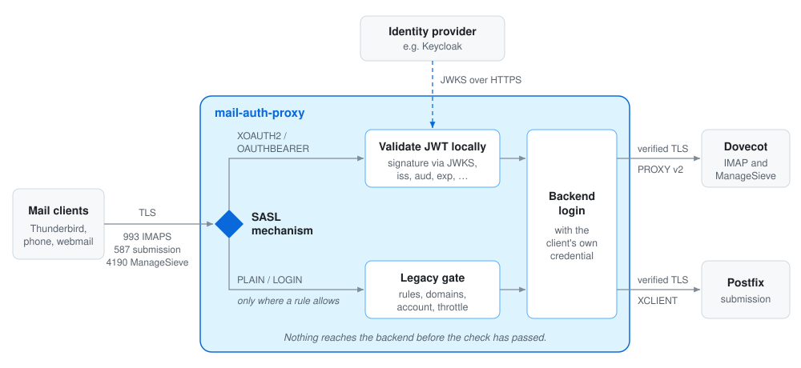

<div align="center">

# mail-auth-proxy

**OAuth2 authentication proxy for IMAP, SMTP submission and ManageSieve**

[](https://github.com/NK-IT-CLOUD/mail-auth-proxy/actions/workflows/ci.yml)
[](https://github.com/NK-IT-CLOUD/mail-auth-proxy/releases)
[](CONTRIBUTING.md#building-and-testing)
[](LICENSE)

[Install](INSTALL.md) ·
[Configuration](docs/configuration.md) ·
[Operations](docs/operations.md) ·
[Security](SECURITY.md) ·
[Contributing](CONTRIBUTING.md) ·
[Changelog](CHANGELOG.md)

</div>

---

mail-auth-proxy sits in front of your mail server, terminates TLS and checks every login
before the backend sees it. OAuth2 tokens (`XOAUTH2`, `OAUTHBEARER`) are validated locally
and then passed unchanged to the backend. Passwords (`PLAIN`, `LOGIN`) get in only through
the legacy gate, which is off by default. After the login the proxy relays bytes; it does
not implement IMAP or SMTP beyond the authentication preamble. It is one static Rust binary
with one configuration file.

## Why

Mail clients have moved to OAuth2, and providers are switching off password logins for
IMAP and SMTP. On your own mail server you want one public endpoint that accepts only valid
tokens, while a few legacy systems (scanners, monitoring, mailflow checks) still need
passwords from known networks. mail-auth-proxy serves both on the same IP and port and
accepts a password only where a rule allows it.

## How it works

<picture>
  <source media="(prefers-color-scheme: dark)" srcset="docs/assets/how-it-works-dark.svg">
  
</picture>

1. The source IP and TLS server name decide which mechanisms the connection offers.
2. The proxy reads `AUTHENTICATE` / `AUTH` and checks the credential: a token against the
   issuer's keys, a password against the legacy gate. Nothing reaches the backend before
   that check has passed.
3. It logs in to the backend with the same credential, passing the real client address
   (PROXY protocol v2 for Dovecot, XCLIENT for Postfix), and relays bytes until either
   side closes.

> [!IMPORTANT]
> The backend must still validate the forwarded token itself; the proxy does not replace
> that check.

## Features

**Token validation**
- The backend receives the client's own token: no master password, no shared secret, no
  introspection call per login.
- Local JWT check against each issuer's JWKS: signature, `iss`, `aud`, `exp`/`nbf`, access
  token only (Keycloak `typ` or RFC 9068 `at+jwt`), `email_verified`, optional client
  allowlist.
- The algorithm comes from the JWKS key, never from the token header; each key is valid only
  for the issuer that published it. `alg=none` and HS* forgeries fail.
- The backend login is the validated identity claim (default `email`), never the user name
  the client typed.

**Password gate** (optional, off by default)
- Connections without a matching rule are OAuth-only.
- Rules per source network, TLS server name, protocol, mechanism and user; allowed domains;
  account check via the doveadm HTTP API; per-account throttle.
- Refused and wrong passwords get the same reply with similar timing; the log keeps the
  reasons apart. Passwords are never logged, only a per-process keyed fingerprint.

**Protocols**
- IMAPS on 993, SMTP submission on 587 (STARTTLS), ManageSieve on 4190 (STARTTLS).
- Client address to the backend via PROXY protocol v2 (Dovecot) and XCLIENT (Postfix).
- Backend TLS is always verified; there is no switch to turn it off.

**Operations**
- One fixed `authresult` log line per login, made for log-based blocking; CrowdSec parser
  and scenarios in [contrib/crowdsec](contrib/crowdsec/).
- Optional Prometheus metrics, systemd unit with `Type=notify`, `SIGHUP` reloads certificates
  and JWKS without dropping connections.
- Connection caps, per-IP pre-auth cap, a pre-auth time budget and size limits on lines,
  literals, tokens and passwords.
- Built-in blocking of source addresses after too many failed logins (tokens and passwords,
  any account), on by default; outages never count.

**Distribution**
- One static `x86_64-unknown-linux-musl` binary; `.deb` (APT repository), `.rpm` and
  `.tar.gz` for each release.
- `SHA256SUMS` signed with the release key; hermetic builds in a digest-pinned container,
  checked in CI by building twice and comparing the bytes.

## Quick start

**Requirements:** Linux on x86_64; a mail backend that validates OAuth2 bearer tokens
itself, for example Dovecot 2.4 with the `oauth2` passdb and Postfix using Dovecot SASL
([setup](docs/backend-dovecot-postfix.md)); an OAuth2 / OpenID Connect provider that
publishes a JWKS and puts your mail audience into access tokens (tested with Keycloak,
[setup](docs/idp-keycloak.md)); a TLS certificate for every name clients use.

**1. Install** from the APT repository (Debian, Ubuntu):

```bash
sudo install -d -m755 /etc/apt/keyrings
curl -fsSL https://apt.nk-it.cloud/gpg.key \
  | sudo gpg --batch --yes --dearmor -o /etc/apt/keyrings/nk-it-cloud.gpg
gpg --show-keys /etc/apt/keyrings/nk-it-cloud.gpg   # A66E 54ED 9E75 BF3D E610  2ED5 AE60 35D7 D6D3 1EB4
echo "deb [signed-by=/etc/apt/keyrings/nk-it-cloud.gpg] https://apt.nk-it.cloud/apt stable main" \
  | sudo tee /etc/apt/sources.list.d/nk-it-cloud.list
sudo apt update
sudo apt install mail-auth-proxy
```

Compare the fingerprint before `apt update`. The package installs the binary, the systemd
unit, the system user `mail-auth-proxy` and a commented example configuration; the service is not
started until you enable it.

<details>
<summary>RHEL-compatible systems (RPM), release archive</summary>

There is no DNF repository. Download the RPM, `SHA256SUMS`, `SHA256SUMS.asc` and
`release-signing-key.asc` from the
[release page](https://github.com/NK-IT-CLOUD/mail-auth-proxy/releases), verify them as
described in [INSTALL.md](INSTALL.md#2-verify-a-download), then:

```bash
sudo rpm --import release-signing-key.asc
rpm -K mail-auth-proxy-X.Y.Z-1.x86_64.rpm        # expect "digests signatures OK"
sudo dnf install ./mail-auth-proxy-X.Y.Z-1.x86_64.rpm
```

For other distributions each release has a `.tar.gz` with the static binary, the example
configuration and the systemd unit; see [INSTALL.md](INSTALL.md#release-archive-targz).

</details>

**2. Configure** `/etc/mail-auth-proxy/config.toml`. A minimal OAuth-only setup for IMAP:

```toml
config_version = 2

[server]
hostname = "mail.example.org"

[tls]
cert = "/etc/mail-auth-proxy/tls/fullchain.pem"
key = "/etc/mail-auth-proxy/tls/privkey.pem"

[imap]
listen = "0.0.0.0:993"
# proxy_protocol = true needs a Dovecot listener with haproxy = yes; without it every login fails
backend = { address = "192.0.2.10:10993", verify_name = "imap.example.org", proxy_protocol = true }

[[oauth.issuers]]
issuer = "https://sso.example.org/realms/mail"
jwks_url = "https://sso.example.org/realms/mail/protocol/openid-connect/certs"
audiences = ["mail"]
token_type = "keycloak"
```

Add `[submission]` and `[sieve]` for SMTP submission and ManageSieve. Every key is described
in [docs/configuration.md](docs/configuration.md); the shipped file
([examples/config.example.toml](examples/config.example.toml)) shows all sections. The
service runs as the system user `mail-auth-proxy`, so configuration,
certificate and key must be `root:mail-auth-proxy`, mode `0640`
([permissions](INSTALL.md#permissions)).

**3. Check and start:**

```bash
sudo mail-auth-proxy --check-config /etc/mail-auth-proxy/config.toml   # lists every problem at once
sudo systemctl enable --now mail-auth-proxy
journalctl -u mail-auth-proxy -n 20                                     # expect "imap listener up"
```

Log in with a mail client and look for `authresult result="ok"` in the journal. After a
certificate renewal, `systemctl reload mail-auth-proxy` loads the new certificates and
refreshes the JWKS without closing open connections; a configuration change needs a restart.

<details>
<summary>Build from source</summary>

```bash
cargo build --release --locked
```

The toolchain is pinned in `rust-toolchain.toml`; the minimum supported Rust version is
1.88. Building needs a C compiler for aws-lc-rs; there is no OpenSSL dependency. Tests,
checks and the source layout are in [CONTRIBUTING.md](CONTRIBUTING.md).

</details>

## Logs and metrics

Every login attempt writes one `authresult` line to the journal:

```
WARN authlog: authresult result="fail" proto="imap" scope="external" mech=PLAIN user=a@gone.test peer=198.51.100.7 reason="unknown_domain" pwfp="5d0f1c7a92b3e416" rule="partner"
```

Its fields and reason values are a stable interface for log parsers (CrowdSec, Wazuh and
the like) and are described in [docs/operations.md](docs/operations.md#the-authresult-line).
A backend outage is answered with a retry-later reply and never logged as a failed login,
so an outage cannot turn into bans of legitimate users.

<details>
<summary>Prometheus metrics</summary>

Off by default; enable with `enabled = true` and a `listen` address in `[metrics]`. The endpoint has no
authentication, so keep it on loopback or a management network.

| Metric | What it counts |
|---|---|
| `mail_auth_proxy_auth_attempts_total` | evaluated credentials by protocol, scope, mechanism and result |
| `mail_auth_proxy_auth_refusals_total` | refused credentials by `authresult` reason |
| `mail_auth_proxy_preauth_aborts_total` | connections that ended before a credential |
| `mail_auth_proxy_token_validate_total` | local JWT validations by result |
| `mail_auth_proxy_connections_total` | connections admitted past the limits |
| `mail_auth_proxy_connections_rejected_total` | connections closed at accept by a limit |
| `mail_auth_proxy_ratelimit_blocks_total` | connections closed at accept because the source is blocked after failed logins |
| `mail_auth_proxy_ratelimit_active_blocks` | sources blocked now |
| `mail_auth_proxy_active_connections` | admitted connections currently open |
| `mail_auth_proxy_backend_errors_total` | backend or account-check outages while a client waited |
| `mail_auth_proxy_upstream_forward_total` | sessions spliced to a backend |
| `mail_auth_proxy_backend_login_duration_seconds` | histogram of successful backend logins |
| `mail_auth_proxy_jwks_last_success_timestamp_seconds` | last JWKS fetch with usable keys, per issuer |
| `mail_auth_proxy_tls_cert_expiry_timestamp_seconds` | expiry of each certificate in use (label `cert`) |

The complete list with labels, including `mail_auth_proxy_build_info`,
`process_start_time_seconds`, the JWKS refresh failures and skipped keys, the legacy-gate and the other
rate-limit counters, is in
[docs/operations.md](docs/operations.md#prometheus-metrics).

</details>

## Documentation

| Document | Content |
|---|---|
| [INSTALL.md](INSTALL.md) | packages, verification, permissions, certificates, upgrade, removal |
| [docs/configuration.md](docs/configuration.md) | every configuration key, default and check |
| [docs/backend-dovecot-postfix.md](docs/backend-dovecot-postfix.md) | Dovecot 2.4 and Postfix behind the proxy |
| [docs/idp-keycloak.md](docs/idp-keycloak.md) | Keycloak realm and mail clients |
| [docs/architecture.md](docs/architecture.md) | token validation, legacy gate, limits, timeouts |
| [docs/protocols.md](docs/protocols.md) | IMAP, SMTP and ManageSieve dialogs and replies |
| [docs/operations.md](docs/operations.md) | logs, metrics, signals, troubleshooting |
| [SECURITY.md](SECURITY.md) | trust boundaries, threat model, operator duties, reporting |

The full index is [docs/README.md](docs/README.md).

## Known limitations

- One authentication attempt per connection; a failed attempt closes it.
- After login the idle limit and the session lifetime limit are off by default
  (`[session]`); TCP keepalive is on. A session does not end when its token expires.
- IMAP `LOGIN` with literals and ManageSieve `LOGIN` are not supported.
- The SMTP `EHLO` list is static (`submission.ehlo_extensions`); `SIZE` is not advertised by
  default.
- Connections closed by a limit, a failed-login block or a timeout get no `421`/`BYE`.
- The failed-login block counts per source address (IPv6 per /64, set by
  `limits.ipv6_source_prefix`): users behind one NAT or webmail server share it unless
  that address is exempt.
- Legacy rules trust the source address: the proxy must see real client addresses (no SNAT
  or load balancer in front). A rule with `sni` needs SNI, which clients connecting by IP
  address do not send.
- Backends other than Dovecot and Postfix have not been tested yet.

The complete list is in
[docs/protocols.md](docs/protocols.md#surprising-and-client-incompatible-behaviour).

## Alternatives

- **nginx, freenginx or Angie mail proxy** with `auth_http`: the decision is delegated to an
  HTTP script you write, and the backend login uses LOGIN/PLAIN, so a token has to be turned
  into a password or a master password. No ManageSieve.
- **Dovecot as a proxy**: can validate tokens itself (oauth2 passdb) and proxy IMAP,
  submission and ManageSieve. Forwarding the user's own token through a Dovecot proxy
  (`proxy_mech`) is documented for recent 2.4 releases; we have not tested it.
- **Stalwart**: a mail server with OAuth support of its own; its migration proxy forwards
  tokens without checking them.

If your mail server already covers your case, you do not need mail-auth-proxy.

## Status

> [!NOTE]
> Pre-1.0. The proxy runs in production in front of Dovecot and Postfix with Thunderbird,
> Android and webmail clients. Before 1.0, a minor release (0.x → 0.y) may change the
> public interface (configuration keys, the `authresult` line, metrics, command line); a
> patch release does not. Every such change is listed in [CHANGELOG.md](CHANGELOG.md).

## Security

Please report vulnerabilities privately, through GitHub's private vulnerability reporting
or by email to security@nk-it.cloud, not in public issues. The security model, threat
model and operator duties are in [SECURITY.md](SECURITY.md).

## License

MIT, see [LICENSE](LICENSE).
