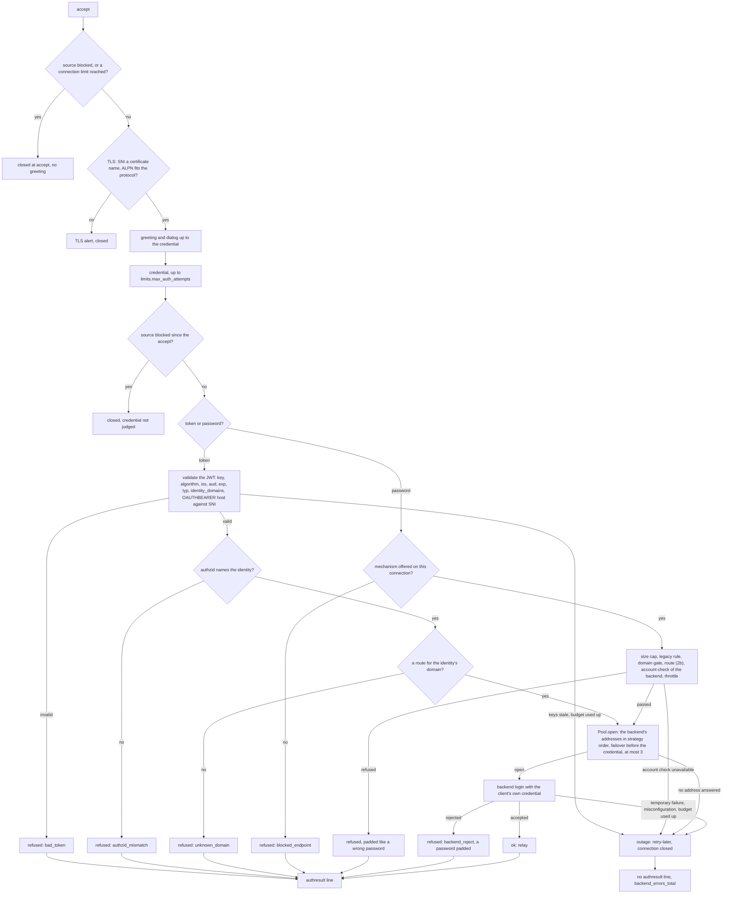

# Architecture

This document covers the parts every protocol shares. The per-protocol dialogs are in [protocols.md](protocols.md), every configuration key in [configuration.md](configuration.md), and logs, metrics and signals in [operations.md](operations.md). It is written from the source in `src/` and checked with the black-box tests in `tests/`; where it and the code disagree, the code wins.

The proxy terminates client TLS for three protocols and runs each protocol's dialog only until the client presents a credential. It then decides whether that credential may be used, logs in to the backend (a standards-conforming IMAP, submission and ManageSieve server such as Dovecot and Postfix) with the client's own credential, and relays bytes without interpreting them. It never holds a master credential. OAuth bearer tokens are validated locally against JWKS keys, never by introspection at the IdP.

| Protocol | Client side | Backend side |
|---|---|---|
| IMAP | implicit TLS on `imap.listen` | `imap.backend` or the routes' backends: implicit TLS (default) or STARTTLS |
| SMTP submission | plaintext + STARTTLS on `submission.listen`; optional implicit TLS on `submission.implicit_tls_listen` | `submission.backend` or the routes' backends: STARTTLS (default) or implicit TLS |
| ManageSieve | plaintext + STARTTLS on `sieve.listen` | `sieve.backend` or the routes' backends: STARTTLS (default) or implicit TLS |

Each backend has a profile ([configuration.md](configuration.md#keys)): `tls` as in the table, `client_ip` (a PROXY protocol v2 header, XCLIENT on submission, or nothing) and `auth_forward` (a token goes as XOAUTH2 or OAUTHBEARER). The profile belongs to the backend, not to the protocol, and every key of it is reloadable.

## Request flow

```
client ──TLS──▶ mail-auth-proxy ─────────────────────────────TLS (verified)──▶ backend
                 1. accept: failed-login block of the source, connection limits
                 2. TLS handshake, SNI noted
                 3. greeting / capabilities: OAuth mechanisms always, PLAIN/LOGIN only
                    where a legacy rule matches source address, SNI and protocol
                 4. read AUTHENTICATE / AUTH / LOGIN (up to limits.max_auth_attempts)
                 5a. OAuth: validate the JWT locally ──────── JWKS (cached, refreshed) ◀── IdP
                 5b. password: legacy gate (rule, domain, route, account check, throttle)
                 6. choose the backend by the routes (domain of the identity or login),
                    connect to it (implicit TLS or STARTTLS), pass the client address
                    (PROXY v2 / XCLIENT / none), log in with the same token (as XOAUTH2 or
                    OAUTHBEARER) or the same password (as PLAIN)
                 7. relay the backend's verdict; on success relay bytes until either side closes
```

Each connection is one tokio task. It takes the configuration in use when it is accepted and keeps it to its end ([configuration reload](#configuration-reload)). Connections share only the JWKS key set, the server certificates, the ManageSieve capability and SMTP EHLO caches of each backend, the health of each backend address, the legacy gate's caches and counters, the connection limits, the failed-login counters and the metrics. Trust boundaries and the threat model are in [SECURITY.md](../SECURITY.md#trust-boundaries).

### Authentication decision

The path every protocol shares, from the accept to the verdict on one credential
(`auth::authorize`, with `legacy::Gate::check_routed` for passwords). The replies and the
backend dialog of each protocol are in [protocols.md](protocols.md): [IMAP](protocols.md#imap-sequence),
[SMTP](protocols.md#smtp-sequence), [ManageSieve](protocols.md#managesieve-sequence).



A refused credential leaves the connection open for the next attempt until the last one
([D-GEN-1](standards.md#d-gen-1-limited-authentication-attempts-per-connection)); an
outage on the password path is answered no earlier than a refusal
([refusal replies and timing](#refusal-replies-and-timing)).

## Startup

- The configuration is validated before anything else; an error aborts the start, and warnings are logged. File paths (`tls.cert`, `tls.key`, `ca_file`, `domains_file`, `doveadm_key_file`, `doveadm_ca_file`, `users_file`) must be absolute: a relative path would resolve against the working directory, so `--check-config` in a shell could pass on files the service never reads. A relative path is a validation error.
- The two per-process HMAC keys, for the password fingerprint (`pwfp`) and for the rate limit's fingerprints of repeated credentials, are generated from the system RNG before the certificate, the JWKS and the listeners. Without a system RNG the proxy refuses to start. The keys are never written anywhere; a restart makes new ones.

## Configuration reload

Everything built from one configuration is one generation: the certificate store and the TLS acceptors, the backends with their trust anchors, the legacy gate, the connection limits, the rate limit's settings, the timeouts and session limits, the token validator with its issuers, the hostname. Each listener reads the generation in use at `accept()` and hands the connection its own reference, which the connection keeps until it ends.

`SIGHUP` reads the file again, runs the checks of `--check-config` and compares the result with the generation in use (`config::plan`): a listener address, a listener more or less, or the metrics endpoint cannot change without binding sockets, so such a file is refused. Otherwise a new generation is built next to the old one and replaces it in one step (a `tokio::sync::watch` value); nothing is changed in place, so a connection sees either the whole old or the whole new configuration, never a mix and never a gap. Building fails without effect: a certificate that does not load, a list file, an issuer whose JWKS cannot be fetched.

State that belongs to the process rather than to a configuration is shared by the generations:

- the counts of open and unauthenticated connections (`Limits::reconfigured`): a lowered limit refuses new connections until enough old ones have ended;
- the rate limit's sources, counts and blocks (`AuthRateLimit::reconfigured`); a block counted under an earlier `ipv6_source_prefix` holds until it expires;
- the legacy throttle's counts and account turns, and the learned refusal timing (`Gate::carry_over`);
- the SMTP EHLO and ManageSieve capability caches of a backend whose settings are unchanged;
- the counters of a backend that keeps its name, and the health of each address it keeps;
- the last JWKS of each issuer: an issuer that stays gets its keys from it under its new rules without a fetch (`Validator::reconfigured`).

The JWKS refresh and the rate limit's sweep run on the generation in use. An old generation lives as long as a connection holds it; the list file reloader of its gate ends with it, and its active health checks end when it is replaced. The metrics' `issuer`, `cert`, `backend` and `address` label sets follow the generation in use.

## Client TLS

- rustls with the aws-lc-rs provider. TLS 1.2 and TLS 1.3 use rustls' default cipher suites. IMAP and ManageSieve negotiate ALPN with their IANA identifiers `imap` and `managesieve`: a client that offers ALPN without that identifier is refused in the handshake (`no_application_protocol`); one that offers none is accepted. SMTP has no identifier and selects none: on both submission listeners (STARTTLS and implicit TLS) a client that offers an ID of the IANA ALPN registry (another protocol: `http/1.1`, `h2`, `imap`, …; GREASE values excepted) is refused before the ServerHello with `no_application_protocol`, one that offers none or only unregistered values is accepted. There is no client-certificate authentication.
- The certificate is chosen by SNI (RFC 6066 §3) from `tls.cert` (the default) and `tls.certificates`: exact DNS name first, then a wildcard for one leftmost label (RFC 9525 §6.3), in canonical form; no SNI gets the default. The accepted names are the subjectAltName DNS names of the configured certificates. The proxy reads the ClientHello first (rustls `Acceptor`); a name that no certificate carries ends the handshake with the fatal alert `unrecognized_name` before a certificate is sent (RFC 9325 §3.7). Details in [configuration.md](configuration.md#tls-server-names).
- The SNI after the handshake is therefore always a name of the proxy. It is used by the legacy rules ([legacy gate](#legacy-gate)) and the OAUTHBEARER `host` check. A client that sends no SNI matches only rules without `sni`. Clients that connect by IP address never send SNI.

## Line reading

Every line read before authentication, from the client and from the backend, goes through the same reader:

- It reads byte by byte up to `\n`, drops `\r`, and requires valid UTF-8. Invalid UTF-8 closes the connection.
- A line may be at most 16384 bytes, counting every byte consumed, bare CRs included. A longer line closes the connection.
- Each single read has an idle timeout of `timeouts.idle_secs` (default 30 s).

The reader never reads past `\n`, so bytes a client pipelines after `STARTTLS` stay in the socket, are fed to the TLS acceptor, and make the handshake fail. This closes the STARTTLS command-injection class (CVE-2011-0411); a black-box test covers it.

## Legacy gate

OAuth and legacy logins take separate paths. OAuth (XOAUTH2, OAUTHBEARER) depends only on local token validation ([OAuth token validation](#oauth-token-validation)); nothing in this section applies to it. Legacy logins (PLAIN, SASL LOGIN, the IMAP LOGIN command) carry a password that only the backend checks; the proxy decides whether to pass it on. Without `[[legacy.rules]]` every endpoint is OAuth-only.

### Offered mechanisms

On each connection, PLAIN and LOGIN are advertised as far as at least one rule matches the connection:

```
rule matches a connection  ⇔  source IP ∈ networks (IPv4-mapped IPv6 canonicalised first)
                              AND  (no sni  OR  SNI equals one of sni, canonical form, exact)
                              AND  (no protocols  OR  protocol ∈ protocols)
offered mechanisms         =  union of the matching rules' mechanisms (default PLAIN and LOGIN)
```

IMAP advertises `LOGINDISABLED` whenever LOGIN is not offered (the LOGIN command counts as the LOGIN mechanism). ManageSieve never offers LOGIN. SMTP offers LOGIN only together with PLAIN (draft-murchison-sasl-login §1).

### Checks on a password attempt

A password the client has sent is always parsed, even when its mechanism is not advertised, so the attempt can be logged with a password fingerprint: the IMAP `LOGIN` command and a PLAIN initial response carry it. A mechanism the connection does not offer is never asked for its password: without an initial response (SASL LOGIN: after the username in the initial response) it is refused at once as `blocked_endpoint`, without `pwfp`. The checks then run in this order, all before any backend contact:

| Step | Check | Refused as |
|---|---|---|
| 0 | the connection offers this mechanism | `blocked_endpoint`, reply "not available on this endpoint" |
| | the password is at most 1024 bytes | `oversize` |
| | the login is not empty, at most 255 bytes, has no control characters and at most one `@` | `unknown_account` |
| 1 | a rule matches connection, mechanism and user (`users`, `users_file`: `user@domain` or `*@domain`; the local part is compared exactly, the domain in canonical form, [configuration: domain names](configuration.md#domain-names)). The first matching rule in file order decides and is logged. | `blocked_endpoint` |
| 2 | the login's domain is in `allowed_domains` ∪ `domains_file` (only if either is set; a login without `@domain` fails) | `unknown_domain` |
| 2b | a route takes the login's domain ([configuration: routes](configuration.md#routes); without `[[routes]]` always) | `unknown_domain` |
| 3 | the account exists (`account_check = "doveadm"` of the backend the route chose, else of `[legacy]`) | `unknown_account` |
| 4 | the account is not throttled (`throttle`) | `throttled` |
| | the backend checks the password; a protocol error in direct answer to the password (SMTP `500` to `509` after the response to `334`, IMAP tagged `BAD`) also counts as a rejection; a reply to the bare SMTP `AUTH` line, an IMAP `* BYE` or a ManageSieve `BYE` (other than `AUTH-TOO-WEAK`, `TRANSITION-NEEDED`) is an outage | `backend_reject` |

The size cap and the protocol-error rule close an enumeration oracle. A backend may answer a crafted password with a protocol error (Postfix does beyond `smtpd_sasl_response_limit`, 12288 octets), and it only ever sees passwords of accounts that passed the gate. An immediate retry-later there, next to a delayed refusal for the other accounts, would tell the two groups apart.

### Refusal replies and timing

The size check, steps 1 to 4 and a wrong password all give the client the protocol's wrong-password reply, and their timing is made alike:

- A refusal by the gate is answered after the larger of `legacy.failure_delay_ms` (default 2000, Dovecot's default `auth_failure_delay`) and the median latency of the last 32 rejections of the backend the login goes to (capped at 10 s), counted from the credential. The latencies are learned per backend, so a refusal matches a wrong password at the backend the routes chose. A refusal in the steps before the account check (size, rule, domain, no route) waits for the backend of the protocol with the largest median: with one set of samples for several backends, a refusal at a slow backend would come as early as the mixed median, sooner than a wrong password there.
- A backend rejection is answered no earlier than `failure_delay_ms` after the credential.
- Both get the same random jitter: up to a quarter of that time, at least 50 ms, at most 1 s.
- An outage on the password path (account check or backend unavailable) is answered with retry-later no earlier than a refusal, with the same jitter. Outages only reach accounts that passed the earlier steps, so an instant answer would identify them.

The log still keeps the cases apart (`reason`, `rule`).

Keep the backend's own failure delay enabled behind the proxy (Dovecot `auth_failure_delay`): it slows down guessing at the backend, and the proxy pads its refusals to it. After a start, until the proxy has seen backend rejections of a protocol, refusals use `failure_delay_ms` alone, so set it close to the backend's delay.

### Account check

Each backend may set its own `account_check` (and `doveadm_*`); a password routed to it is checked that way, `none` meaning no check. A backend without one uses `[legacy]`'s. One doveadm for several mail systems would refuse the accounts of all but its own.

A userdb lookup over the Dovecot doveadm HTTP API (Dovecot 2.4): `POST <doveadm_url>` with `Authorization: X-Dovecot-API <base64 of the API key>` and `[["user", {"userMask": "<login>", "userdbOnly": true}, "u"]]`. `doveadmResponse` means the user exists; `error` with `exitCode` 67 (EX_NOUSER) means it does not.

Any other answer, an HTTP error, a TLS failure or a timeout (`timeouts.connect_secs`) is an outage: the client gets the retry-later reply, `mail_auth_proxy_backend_errors_total` counts it, no `authresult` line is written and the password is not forwarded.

- Answers are cached (existing 120 s, missing 30 s, at most 10 000 logins); outages are not cached.
- Logins containing `*` or `?` are never sent (doveadm would list matching users) and count as unknown.
- TLS is verified against the system store or `doveadm_ca_file`. Plain http is allowed only to localhost. A URL with `user:password@` is refused; the key belongs in `doveadm_key_file`. The Authorization header is marked sensitive.

Sources: doc.dovecot.org 2.4.5 "Doveadm → HTTP API" and the `user` command in "All Doveadm Commands".

### Throttle

Each backend rejection counts against the account for `window_secs` from its first failure. The key is the login folded to ASCII lower case, so `Bob@x` and `bob@x` share one counter. Once `failures` is reached, further attempts are refused without asking the backend until the window ends. A successful login resets the count. Password attempts for one account take turns: the next one is checked only after the previous one has its backend verdict counted, so parallel connections cannot run more attempts than `failures` allows. Correct passwords wait at most for one backend answer; nothing is refused because of parallel logins. At most 65 536 accounts are tracked. When a new account finds the table full, expired entries are dropped first, then the oldest running ones, down to 1,024 below the limit, so the scan under the lock runs once per 1,024 new accounts; the running windows dropped are counted in `mail_auth_proxy_legacy_throttle_evictions_total`. Only rejections of existing accounts are counted, so unknown names do not fill the table.

### User and domain files

`users_file` and `domains_file` hold one entry per line; blank lines and lines starting with `#` are ignored. They are read at startup; an unreadable or invalid file aborts startup and fails `--check-config`. A background task re-reads a file when its modification time, size or inode changes, checked every 2 seconds.

A file that becomes missing, unreadable or invalid **fails closed**: a rule with that `users_file` matches nobody (its inline `users` included), and a broken `domains_file` closes the domain gate (inline `allowed_domains` included). This is logged at `ERROR`, counted in `mail_auth_proxy_legacy_list_errors_total`, and retried on every check until the file is fixed, so a broken update can never keep a revoked entry alive.

### Login names

The gate compares the login the client sent, its domain in canonical form ([configuration: domain names](configuration.md#domain-names)), and assumes the backend uses that same login as the account name; the backend gets the login byte for byte as sent. An `auth_username_format` that strips the domain or otherwise maps several logins to one account breaks this: the domain gate, user lists and throttle then see a different name than the backend.

### Scope label

A source IP in `scope.internal_networks` counts as `scope=internal`, whatever the SNI and the rules. The label feeds logs and metrics and grants nothing.

### `[password_gate]`

`[password_gate]` (`enabled`, `sni`, `internal_networks`) is the short form of one rule named `password_gate` with those networks and names (all protocols, mechanisms and users), plus the scope label from `internal_networks` when `[scope]` is absent. It can be combined with `[legacy]` settings (domains, account check, throttle) but not with `[[legacy.rules]]`. `--print-config` shows the rule form.

## SASL mechanisms

| Mechanism | Client → proxy | Proxy → backend |
|---|---|---|
| `XOAUTH2` | `user=<u>^Aauth=Bearer <jwt>^A^A`. The scheme `Bearer` is case-insensitive and `user=` must not be empty. | with `auth_forward = "xoauth2"` (default): `XOAUTH2` rebuilt as `user=<validated identity claim>^Aauth=Bearer <same jwt>^A^A`; with `auth_forward = "oauthbearer"`: `OAUTHBEARER` rebuilt as `n,a=<validated identity claim>,^Ahost=<backend name>^Aport=<backend port>^Aauth=Bearer <same jwt>^A^A` (RFC 7628 §3.1) |
| `OAUTHBEARER` | GS2 header `n,a=<authzid>,` or `y,…` (the authzid is optional: `n,,`; `=2C` and `=3D` in it stand for `,` and `=`; `p=` channel binding is refused), then `^A`-separated fields with `auth=Bearer <jwt>`. A `host=` must match the TLS server name when the client sent SNI (RFC 7628 §3.2; the same domain in canonical form), otherwise the token counts as rejected (`bad_token`). `port=` is ignored. | as for `XOAUTH2`: the backend's `auth_forward` mechanism, rebuilt |
| `PLAIN` | `authzid\0authcid\0passwd`. User and password must be non-empty, and the password must not contain a NUL (RFC 4616 §2). The login is the authcid; a non-empty authzid must equal it, otherwise the exchange fails (acting as another user is not supported). | `PLAIN` rebuilt as `\0<login>\0<passwd>` (empty authzid) |
| `LOGIN` | Two base64 prompts (`Username:`, `Password:`). An initial response on the AUTH line is the username; then only the password is asked for. Neither field may contain a NUL. IMAP and SMTP only. | sent as `PLAIN` |

A SASL user the client names (XOAUTH2 `user=`, OAUTHBEARER `a=`) longer than 255 bytes or with control characters makes the response malformed. An OAuth response whose `auth` value is empty (`auth=`, or `Bearer` without a token) is a discovery request (RFC 7628 §4.3): it gets the error result of a rejected token ([protocols](protocols.md#oauth-error-result)), is logged as `protocol` and counts as no failed login.

For OAuth, the login forwarded to the backend is always the token's `identity_claim` (default `email`). The username the client supplies (XOAUTH2 `user=`, OAUTHBEARER `a=`, the SASL authorisation identity) is logged when validation fails. Once the token is valid, that username must be empty, name the same identity (local part ASCII case-insensitive, domain in canonical form), or be its local part without a domain (ASCII case-insensitive). Any other name fails the exchange with `authzid_mismatch` before the backend is contacted (RFC 4422 §3.6).

### Credentials in memory

Passwords, bearer tokens and the SASL responses that carry them are held in buffers that are overwritten with zeros when they are dropped (the [`zeroize`](https://crates.io/crates/zeroize) crate):

- every client line before authentication (an IMAP `LOGIN` line or an `AUTHENTICATE`/`AUTH` line can carry the credential), including the buffers it outgrew while being read;
- the SASL response lines, their base64-decoded bytes (also when decoding fails half-way), the unquoted ManageSieve response and literal;
- the parsed password or token;
- the `XOAUTH2`, `OAUTHBEARER` or `PLAIN` response rebuilt for the backend, in raw and base64 form, and the command line that carries it.

The credential is dropped right after the backend login, before the session is relayed. Types that hold one print `<redacted>` in `Debug`, and error texts name neither the credential nor a byte of its base64 encoding; the log keeps only the keyed password fingerprint (`pwfp`).

This narrows how long a credential stays in the proxy's heap. It does not remove every copy, and some are out of the proxy's reach:

- the TLS libraries: rustls keeps decrypted client data and the plaintext written to the backend in its own buffers, and tokio's TLS stream and the kernel's socket buffers hold them before encryption and after decryption;
- token validation: `jsonwebtoken` and the crypto library decode the token's parts into their own buffers; the password fingerprint is an HMAC computed inside aws-lc;
- the operating system: memory can be swapped to disk or end up in a core dump unless swap is encrypted or disabled and core dumps are off for the service;
- the compiler can keep copies in registers or on the stack, which `zeroize` does not reach.

The user name is not treated as a secret and is not zeroized.

## OAuth token validation

Validation is local; the proxy makes no introspection or userinfo call. A token over 16384 bytes is a `bad_token` without validation. A token whose JWS header has a `crit` member is a `bad_token` too: the proxy understands no JWS extension (RFC 7515 §4.1.11). Validation, with any JWKS refresh it waits for, must finish within the pre-auth budget; a validation that runs out is an outage (retry-later). The refresh itself still completes and records its result, so the 30 s spacing below holds while an IdP is slow.

1. Key selection. The `kid` from the JWT header is looked up. A token without `kid` uses the key id `"default"`, which also matches JWKS keys that have no `kid`. An unknown `kid` triggers one refresh of all JWKS and a second lookup. These on-demand refreshes happen at most every 30 s and are serialised with the periodic refresh, so an older snapshot never overwrites a newer one; tokens arriving during a refresh wait for it. If the key is still unknown, the result of the last on-demand refresh decides (this one, or the one less than 30 s ago that made this one wait):
   - It succeeded for the issuer the token claims in `iss`, or the token claims no configured issuer: the token is rejected as `bad_token`. A flood of random `kid`s therefore stays visible to CrowdSec, also while another issuer's JWKS is down.
   - It failed for that issuer: the answer is retry-later (an outage, no `authresult` line), because a key rotated in while the IdP was unreachable must not look like a forged token.

   The `iss` is read unverified here, only to pick the refresh result. An `iss` that is not a string (an array is invalid anyway, step 4) counts as no configured issuer.
2. Algorithm pinned to the key. The algorithm comes from the JWKS key, never from the token header. A key with `alg` is used with exactly that algorithm. A key without `alg` is used with the one algorithm its type implies (ES256 for P-256, ES384 for P-384, RS256 for RSA), or skipped when the issuer sets `infer_key_algorithm = false`. Every key therefore has exactly one algorithm (RFC 8725 §3.1). Either way only the issuer's `allowed_algorithms` count. An RSA key used with another algorithm must say so in its `alg`. Keys are skipped when their algorithm is not allowed, when `kty` is not `EC`/`RSA`, when they declare a `use` other than `sig`, or when their `key_ops` do not include `verify` (a missing `use` or `key_ops` is accepted). `alg=none` and HS* forgeries fail.
3. Issuer bound to the key. Each `[[oauth.issuers]]` entry pairs one `issuer` with its `jwks_url`, and each key is accepted only with the `iss` of the issuer whose JWKS published it. A realm-B key cannot sign a token that claims realm A. If several issuers publish the same `kid`, each candidate key is tried against its own issuer.
4. Required claims: `iss`, `aud`, `exp`. `iss` must be a string (RFC 7519 §4.1.1); an array is refused. `aud` may be a string or an array and must contain one of the issuer's `audiences`.
5. Time checks: `exp` is checked, and `nbf` when present. The leeway is `oauth.leeway_secs` (default 60 s), so a token is still accepted up to 60 s after `exp` and up to 60 s before `nbf`.
6. Issuer rules:
   - Access tokens only, per `token_type`. `keycloak`: the claim `typ` equals `Bearer` (case-insensitive), so ID tokens (`typ=ID`) and tokens without `typ` fail. `rfc9068`: the JWT header `typ` is `at+jwt` or `application/at+jwt`. `any`: no check.
   - `email_verified` must be the JSON boolean `true` when `require_email_verified` is on (default for `identity_claim = "email"`). Missing, `false` or the string `"true"` fail.
   - With `allowed_clients` set, the `client_claim` must be one of them. It defaults to `client_id` for `token_type = "rfc9068"` (RFC 9068 §2.2) and to `azp` otherwise.
7. Identity: the `identity_claim` (default `email`). It must be a string of at most 254 characters without whitespace or control characters; for `email` also exactly one `@` with non-empty local part and domain. With `identity_domains` set, it must be an address whose domain is one of them (canonical form, no subdomains). It is forwarded to the backend as the login, as the token has it.

JWKS handling:

- The JWKS of all issuers are fetched in parallel, each with a 10 s timeout, at startup, on every refresh and for an unknown `kid`. One round therefore takes at most one fetch timeout, however many IdPs are down, and so does the wait of a token that needs it.
- At startup, if any configured JWKS is unreachable, unparsable, or has no usable key, **the proxy refuses to start**.
- It refreshes all JWKS every `oauth.refresh_secs` (default 300 s). An issuer whose refresh succeeds has its keys fully replaced, which is how key revocation takes effect. An issuer whose refresh fails keeps its previous keys.
- A key with missing or undecodable members is skipped with a warning (RFC 7517 §5) and counted in `mail_auth_proxy_jwks_keys_skipped_total`; the other keys of the set are used. Only a set without any usable key fails.
- A signing key published after the last refresh is picked up by the unknown-`kid` refresh (step 1), so it is accepted within seconds. Random `kid`s cannot cause more than one refresh per 30 s.
- JWKS URLs must use `https://`; plain `http://` is accepted only for `localhost`, `127.0.0.1` and `::1`. Only a 2xx response is used: another status, a redirect (never followed), or a body over 256 KiB fails the fetch.
- TLS for JWKS fetches uses rustls-platform-verifier, that is, the system trust store.

## Backend TLS

- Each backend has its own trust anchors: the CAs in its `ca_file`, or the system store (`rustls-native-certs`, which also honours `SSL_CERT_FILE`/`SSL_CERT_DIR`). Certificate verification cannot be turned off.
- The name verified is the backend's `verify_name`, or the host part of each address.
- `tls = "implicit"` starts the handshake on the new connection; `tls = "starttls"` reads the plaintext greeting, sends the protocol's STARTTLS and starts the handshake after the backend's go-ahead. Nothing the backend sent before TLS is used afterwards: IMAP and ManageSieve capabilities, and the SMTP EHLO extensions, are read again over TLS (RFC 9051 §6.2.1, RFC 5804 §2.2, RFC 3207 §4.2). The line reader takes one byte at a time, so no byte after the go-ahead is read as plaintext.
- TCP connect and TLS handshake each have a `timeouts.connect_secs` timeout (default 10 s).
- A backend with several `addresses` is a pool: a login moves to the next address only while no credential has been sent, and a temporary failure after the credential is an outage of that login ([configuration: backend pools](configuration.md#backend-pools)).

## Client address: PROXY protocol v2, XCLIENT, none

A backend's `client_ip` says how it learns the client address.

- `proxy_v2` (any backend; short form `proxy_protocol = true`): the proxy writes a binary PROXY v2 header (command `PROXY`, `TCP4` or `TCP6`) as the first bytes of that backend connection, before the greeting and TLS.
  - The source is the client address and the destination is the local address the client connected to. An IPv4-mapped pair (from a dual-stack listener) is sent as `TCP4`.
  - The proxy's own connections, the ManageSieve capability probe ([protocols: ManageSieve after TLS](protocols.md#managesieve-after-tls)), the SMTP EHLO probe and the active health checks (`health_check_secs`), send a PROXY v2 `LOCAL` header (no addresses).
  - The backend listener must require the header (Dovecot `haproxy = yes`, Postfix `smtpd_upstream_proxy_protocol = haproxy`); switch both settings together.
- `none`: nothing. The backend sees the proxy's address for every client, so its own per-address rate limits, bans (fail2ban on the backend host, a server's built-in blocking of failing addresses) and logs treat all clients as one: one abusive client can get every user blocked there. The proxy's own rate limit still sees the real addresses. Validation warns about it.
- `xclient` (submission only; short form `submission.xclient = true`): the proxy sends `XCLIENT [HELO=<client EHLO name>] [PROTO=ESMTP|SMTP] [PORT=<client port>] NAME=[UNAVAILABLE] ADDR=<ipv4>` (or `ADDR=IPV6:<ipv6>`) after the backend's post-TLS EHLO, HELO, PROTO and PORT only where the backend lists them in its `XCLIENT` line, but only if the backend advertises `XCLIENT`; otherwise the step is skipped silently. With any other `client_ip`, a backend that advertises `XCLIENT` to the proxy is an outage and no credential is sent. The same applies when the `EHLO` after the proxy's `XCLIENT` still lists it, because the client's own address would then be authorized for it.

## After authentication

Once the backend accepts the credential, the proxy relays both ways until either side closes. SMTP is relayed with `tokio::io::copy_bidirectional`, without interpreting it. IMAP and ManageSieve pass the client's commands through the command guard (`wire::guard`): it keeps `UNAUTHENTICATE`, a second login, `STARTTLS` and IMAP `COMPRESS` from the backend and takes `UNAUTHENTICATE` out of the capabilities the backend sends ([protocols](protocols.md#imap-and-managesieve-after-login)). The guard is a state machine without I/O; the relay runs both directions concurrently in the session's task, reads 16 KiB at a time and holds at most a line start (256 octets) or a capability line (16 KiB), never a literal. While the guard waits for the backend's answer to an IMAP literal, the client is not read, and TCP pushes back. The credential is dropped (and zeroized) before the relay starts.

- **TCP keepalive** is on for every client connection from `accept()` and every backend connection from `connect()`: after `session.keepalive_idle_secs` (600 s) of silence the kernel probes every `session.keepalive_interval_secs` (60 s) and drops the connection after `session.keepalive_count` (5) unanswered probes. A peer that vanished without a FIN or RST (a phone that left the network, a crashed host) is found after at most 15 minutes of silence; the failed read ends the relay and frees the `max_connections` slot. A connection with unacknowledged data is not probed; it ends by the kernel's retransmission timeout instead.
- **`session.idle_limit_secs`** (off by default) closes a session after that long without a byte in either direction. Reads and writes both count, so a client that slowly drains a large response is not idle, and neither is an IDLE session whose client re-issues IDLE or whose backend sends updates. Below 30 minutes `--check-config` warns: RFC 9051 §5.4 and RFC 5804 §1.2 let clients rely on 30 minutes of post-login inactivity, and IDLE clients re-issue IDLE only every 29 minutes (RFC 9051 §6.3.13). SMTP's 5-minute server timeout (RFC 5321 §4.5.3.2.7) is lower, and Postfix enforces its own.
- **`session.max_session_secs`** (off by default) closes a session that long after the login, busy or not. It bounds how long a session outlives the credential it was opened with, for example after the account was locked in the directory or the IdP.
- When a limit or the command guard ends a session, the proxy closes both TLS streams (close_notify, then FIN), within 2 s. It sends no `* BYE`, `BYE` or `421` of its own: a limit can fire in the middle of a response (an IMAP or ManageSieve literal, an SMTP multi-line reply), and a line injected into a literal would become part of the client's data. Clients see a closed connection and reconnect ([standards: D-GEN-3](standards.md#d-gen-3-no-bye-or-421-when-a-session-limit-ends-a-session)).
- The session does not end at the token's `exp`. IMAP, SMTP and ManageSieve have no re-authentication within a session (IMAP AUTHENTICATE only in the Not Authenticated state, RFC 9051 §6.2.2; a second SMTP AUTH is refused, RFC 4954 §4), so an access token that lives a few minutes would cut every IDLE session that often, below the 30-minute floor above, and a password session has no `exp` at all. `session.max_session_secs` is the bound for both kinds of credential.
- Each end is counted in `mail_auth_proxy_sessions_ended_total{proto,reason}` ([operations](operations.md#prometheus-metrics)).

There is no per-user or per-IP limit on logged-in sessions.

## Connection limits

Limits are checked at `accept()`, before TLS:

| Limit | Default | Scope |
|---|---|---|
| `limits.max_connections` | 2048 | open client connections across all three listeners |
| unauthenticated share | `max(max_connections / 2, 1)` | unauthenticated connections across all listeners and all IPs |
| `limits.max_preauth_per_ip` | 32 | unauthenticated connections per source IP (IPv6: per network of `limits.ipv6_source_prefix`, default /64), **shared across IMAP, SMTP and Sieve** |

- A connection over any limit is closed at once, with no protocol greeting, no `421` and no `BYE`. It is counted in `mail_auth_proxy_connections_rejected_total{proto}`.
- The per-IP slot and the unauthenticated-share slot are released once the backend accepts the credential. An authenticated session counts only against `max_connections`, so many logged-in sessions from one IP (a webmail host, a NAT) do not exhaust the per-IP limit.

## Failed-login rate limit

`[auth_ratelimit]` blocks a source address that presents too many refused credentials. A connection takes at most `limits.max_auth_attempts` credentials (default 3), so a guesser soon needs new connections; the per-account throttle covers passwords only, and only per account. The rate limit also covers token guessing, scanners and password spraying over many accounts, without a log-based blocker.

- **Source:** an IPv4 address (also IPv4-mapped), or an IPv6 network whose prefix length `limits.ipv6_source_prefix` sets (32 to 64, default 64), as for `limits.max_preauth_per_ip`. One host usually holds a whole /64; with 48, a site that rotates through its /64s stays one source.
- **Counted:** every refused credential, one per `authresult` line with `result="fail"` and a credential: `bad_token`, `authzid_mismatch`, `blocked_endpoint`, `unknown_domain`, `unknown_account`, `throttled`, `oversize`, `backend_reject`. All reasons count alike, so the attempt that starts a block tells nothing about the account; `throttled` counts for the same reason (it occurs only for accounts that exist).
- **Not counted:** `protocol` (no credential: a TLS or certificate fault on the proxy's side would otherwise block every client), and every outage: an unavailable backend or account check, or token keys that could not be checked. Outages write no `authresult` line and never block anyone.
- **Repeats:** a credential identical to one of the source's last 8 failures in the window (same user and same password or token) counts once. A client retrying a stale password or an expired token does not block its address, and repeating a guess gains nothing. The comparison uses a keyed 64-bit fingerprint; the secret is not kept.
- **Successful logins** do not reset the count: one valid account must not clear the way for guesses at others.
- **Block:** after `failures` counted failures within `window_secs` (a window starts with the first failure), new connections from the source are closed at accept for `block_secs`, on every listener. An open connection from the source is closed at its next credential, before it is judged. Each further block of the same source doubles, up to `max_block_secs`; the escalation is forgotten once the last block ended `max_block_secs` ago. Failures of connections opened before the block do not extend it.
- **Exempt:** sources in `exempt_networks` (default: loopback), and with `exempt_internal = true` also sources in `scope.internal_networks`. They are neither counted nor blocked, so a source that a reload exempts is free at once.
- **Memory:** at most 65,536 sources. A full table first drops entries with nothing left to remember, then the least valuable 1,024 (unblocked before blocked, oldest first); they are counted in `mail_auth_proxy_ratelimit_evictions_total`. Entries are also swept every 10 s.

A blocked connection is closed like one over a connection limit: before TLS, with no greeting, no `421`, no `554` and no `BYE`. RFC 5321 (section 3.1: `554` instead of the greeting) and RFC 9051 (section 7.1.5: `BYE` as the greeting) allow a server to turn a connection away with a reply, but on the implicit-TLS IMAP port that reply needs a full TLS handshake per blocked connection, and a distinct reply would tell a guesser that it was blocked and how fast it may go. A client behind a blocked address sees a connection failure, the same as with a firewall-based ban.

The block does not change the reply timing of the credentials before it: a refusal is answered as late as before ([Refusal replies and timing](#refusal-replies-and-timing)), and the count is the same for every reason, so neither the block nor its timing tells whether an account exists.

The block starts with one `ratelimit` log line ([operations: other log lines](operations.md#other-log-lines)); every closed connection counts in `mail_auth_proxy_ratelimit_blocks_total{proto}`, not in `connections_rejected_total`. Sessions that were logged in before the block keep running.

To keep observing attacks on a legacy rule open to public networks, as a honeypot, set `enabled = false` or a high `failures`; the `authresult` lines then keep coming for every attempt.

## Timeouts

| Setting | Default | Applies to |
|---|---|---|
| `timeouts.idle_secs` | 30 s | every single `read_line` read (idle), on client and backend |
| `timeouts.preauth_secs` | 60 s total | from accept to the backend's verdict: TLS handshake, plaintext dialog, SASL, token validation (with a JWKS refresh), the legacy account check and the backend login. Activity does not reset it, so drip-feeding does not help. |
| `timeouts.connect_secs` | 10 s | backend TCP connect; backend TLS handshake; writing the PROXY header |
| `limits.max_preauth_commands` | 8 | commands before a credential (per phase for SMTP and Sieve), across all attempts |
| `limits.max_auth_attempts` | 3 | authentication attempts per connection, within the one pre-auth budget |
| JWKS fetch (fixed) | 10 s | per URL; all URLs are fetched in parallel |
| `oauth.refresh_secs` | 300 s | periodic JWKS refresh of all URLs |
| `sieve.capability_cache_secs` | 600 s | backend post-TLS capabilities |
| `submission.capability_cache_secs` | 600 s | backend post-TLS EHLO extensions |
| metrics scrape (fixed) | 10 s, 4 at a time | the whole request head, and the response, each; a fifth connection is closed at accept |
| backend auth reply (fixed) | at most 32 lines | IMAP `P1` reply; each line within the idle timeout |
| `session.keepalive_idle_secs`, `_interval_secs`, `_count` | 600 s, 60 s, 5 | TCP keepalive of every client and backend connection, from accept or connect ([after authentication](#after-authentication)) |
| `session.idle_limit_secs` | off | after login: no byte in either direction |
| `session.max_session_secs` | off | after login: time since the login |
| session close (fixed) | 2 s | closing both TLS streams after a session limit |
| shutdown drain (fixed) | 10 s | after SIGTERM/SIGINT, how long open sessions may continue ([operations: signals](operations.md#signals-and-service-manager)) |

The pre-auth budget also covers token validation, the account check and the backend phase (connect, greeting, AUTH verdict); the connect and idle timeouts bound each step within it. A credential whose check or backend login runs out of budget gets the retry-later reply: an outage (`mail_auth_proxy_backend_errors_total`), not a failed login. Only the padding of a refused password may end after the budget.

A timeout closes the connection silently, with no `* BYE` and no `421`.
