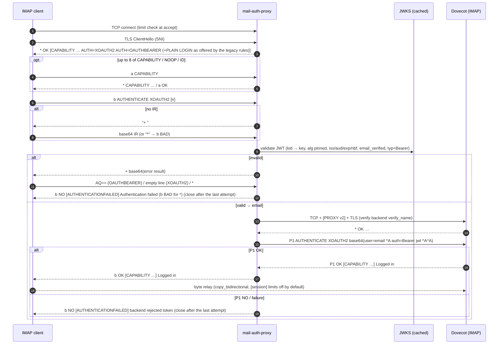
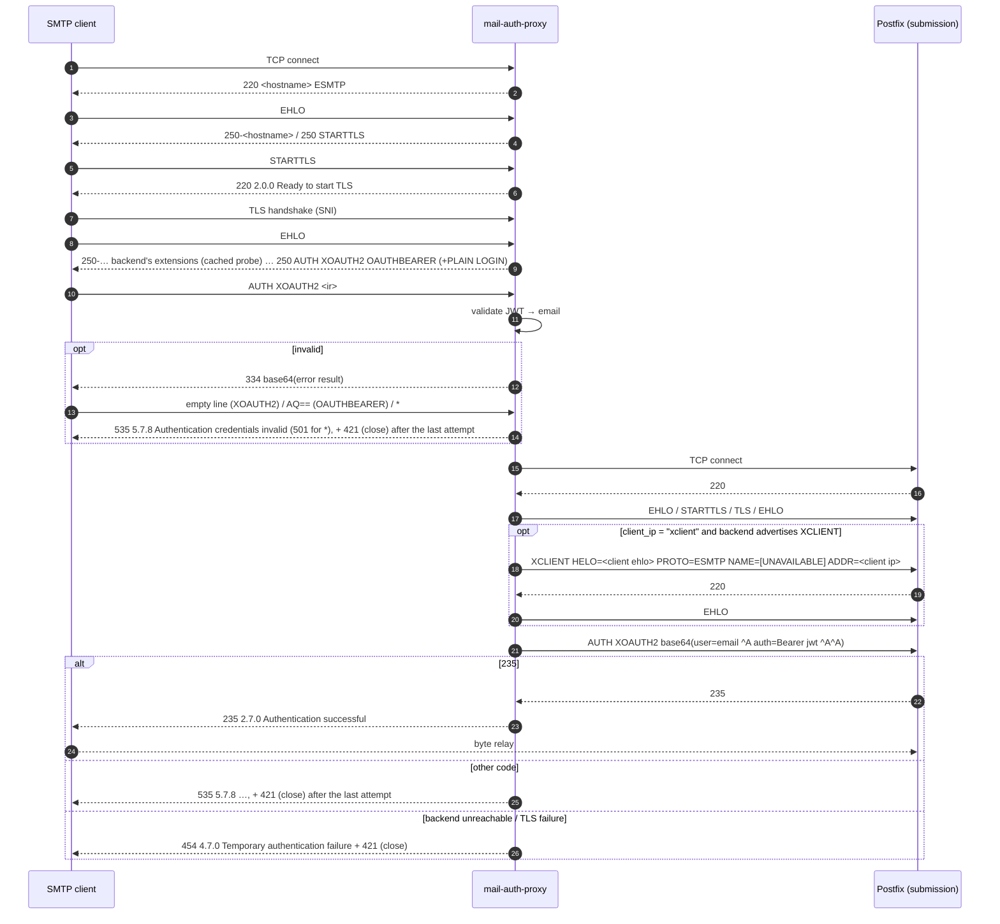
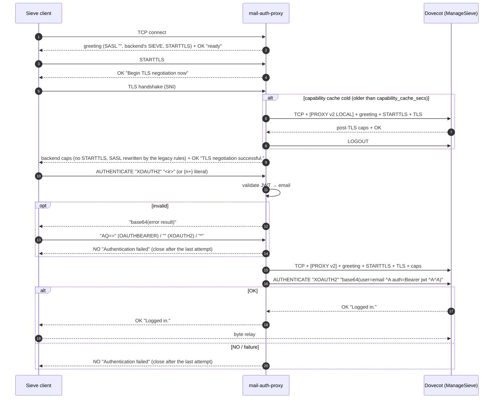

# Protocol dialogs

What the proxy sends and accepts on each protocol before authentication, how it logs in to the backend, and which reply the client gets for each outcome. `<hostname>` stands for `server.hostname`, and the `authlog reason` column refers to the [`authresult` line](operations.md#the-authresult-line). This document is written from the source in `src/proto/` and checked with the black-box tests in `tests/`; where it and the code disagree, the code wins. Deviations from the standards are listed one by one in [standards.md](standards.md).

The backend login steps depend on the backend's profile ([configuration.md](configuration.md#keys)): `tls` (STARTTLS or implicit TLS to the backend; default implicit for IMAP, STARTTLS for submission and ManageSieve), `client_ip` (a PROXY v2 header, XCLIENT, or nothing) and `auth_forward` (a token goes as XOAUTH2, the default, or OAUTHBEARER). A password always goes as PLAIN. The sequence diagrams show the defaults. A backend with several `addresses` (a pool) is tried address by address in the backend login steps below: a failure before the credential is sent moves the login to the next address, at most 3; once the credential is sent, the login stays on that address ([configuration: backend pools](configuration.md#backend-pools)).

A token forwarded as OAUTHBEARER (RFC 7628 §3.1) is `n,a=<identity>,^Ahost=<backend name>^Aport=<backend port>^Aauth=Bearer <token>^A^A`: the verified identity as GS2 authzid (`,` and `=` escaped as `=2C`, `=3D`), the backend's `verify_name` (or the host of the address it connects to) and that address's port. When the backend fails it, its error result is answered with `%x01` (`AQ==`, §3.2.3) and the final failure is read as for XOAUTH2. An error result whose `status` is `invalid_request` means the backend judged no token (RFC 6750 §3.1): the login is an outage, not a rejection; any other status, and an error result that is no JSON object with a string `status`, leave the final reply as the verdict.

## IMAP (implicit TLS)

### IMAP: pre-auth dialog

On connect, the proxy completes the TLS handshake (inside the pre-auth budget) and then sends a greeting:

```
* OK [CAPABILITY IMAP4rev1 SASL-IR ID LOGINDISABLED AUTH=XOAUTH2 AUTH=OAUTHBEARER] <hostname> ready
* OK [CAPABILITY IMAP4rev1 SASL-IR ID AUTH=XOAUTH2 AUTH=OAUTHBEARER AUTH=PLAIN AUTH=LOGIN] <hostname> ready   (PLAIN and LOGIN offered by a legacy rule)
```

A line is split as `<tag> SP <command> [SP <rest>]`. Commands are case-insensitive, and the tag is any non-empty token.

| Client sends | Proxy replies | Connection |
|---|---|---|
| `t CAPABILITY` | `* CAPABILITY <same list>` + `t OK CAPABILITY completed` | stays open |
| `t NOOP` | `t OK NOOP completed` | stays open |
| `t ID …` | `* ID NIL` + `t OK ID completed` | stays open |
| `t LOGOUT` | `* BYE <hostname> signing off` + `t OK LOGOUT completed` | closed; no authlog line |
| `t LOGIN <user> <pass>` (atom, quoted string with `\"` `\\` escapes, or literal) | goes to the credential phase | |
| `t LOGIN … {n}` (synchronising literal, up to 16384 octets) | `+ Ready for literal data`, then the octets and the rest of the command on the next line | stays open |
| `t LOGIN … {n+}` (non-synchronising literal) | the octets and the rest of the command follow at once | stays open |
| `t LOGIN … {n}` on a connection that offers no LOGIN | `t NO password authentication not available on this endpoint`, no continuation | stays open; an attempt |
| `t LOGIN` with bad quoting, a malformed or larger literal, or a NUL | `t BAD LOGIN arguments` | closed |
| `t LOGIN "" x` | `t NO LOGIN empty field` | stays open; an attempt |
| `t AUTHENTICATE <mech> [<ir>]` with a supported mech | SASL exchange, [below](#imap-sasl-exchange) | |
| `t AUTHENTICATE` (no mech) | `t BAD AUTHENTICATE needs a mechanism` | stays open; an attempt |
| `t AUTHENTICATE CRAM-MD5` (any other mech) | `t NO unsupported SASL mechanism` | stays open; an attempt |
| any other command, including `STARTTLS`, `ENABLE`, `SELECT` | `t NO command not supported before authentication` | closed |
| a line without tag or command, or an empty line | `* BAD expected: tag command` | closed |
| an 8th non-final command | its reply, then `* BYE too many commands before authentication` | closed |

On an OAuth-only endpoint the capabilities include `LOGINDISABLED`. A `LOGIN` command sent anyway is parsed so the attempt can be logged, then rejected ([decision](#imap-decision-and-backend-login)).

A client that reads the greeting and disconnects before its first command (a health check) ends the session cleanly, with no authlog record and no pre-auth abort.

### IMAP: SASL exchange

- Initial response: the SASL-IR on the command line is used if there is one; `=` is the empty response (RFC 4959 §3). Otherwise the proxy sends `+ ` (plus and a space) and reads one line.
- LOGIN: `+ VXNlcm5hbWU6`, then `+ UGFzc3dvcmQ6`. Each answer is base64. An IR on the command line is the username, and only the password prompt follows.
- PLAIN or LOGIN on a connection that does not offer it: the password is never asked for. Without an initial response (for LOGIN: after decoding the username from it) the answer is at once `t NO password authentication not available on this endpoint` ([below](#imap-decision-and-backend-login)).
- Cancel: a line that is only `*` cancels. It and a response that is not base64 get `t BAD AUTHENTICATE failed: invalid or cancelled response` (RFC 9051 §6.2.2).
- A response that decodes but holds no valid credential gets `t NO [AUTHENTICATIONFAILED] Authentication failed`: a PLAIN message without two NULs, with a NUL in the password or an authzid other than the login, a NUL in a LOGIN field, an OAuth response without `auth=Bearer <token>`, a malformed OAUTHBEARER GS2 header (the flag must be `n` or `y`, `p=` is refused), a malformed `host`, or a SASL user over 255 bytes or with control characters. Such a response carries no usable credential: the `authresult` line is `protocol`.
- An OAuth response with an empty `auth` value (`auth=`, or `Bearer` without a token) is a discovery request (RFC 7628 §4.3): it gets the [OAuth error result](#oauth-error-result) like a rejected token, and its `authresult` line is `protocol` with the mechanism and the SASL user. It is not a failed login and does not count in the rate limit.

Each of these is an attempt: the connection stays open for another one, up to `limits.max_auth_attempts` ([below](#imap-decision-and-backend-login)). A response line that cannot be read (over 16384 bytes, the idle timeout, a close) ends the connection.

### IMAP: decision and backend login

| Situation | Client sees | authlog `reason` |
|---|---|---|
| password with a mechanism the connection does not offer | `t NO password authentication not available on this endpoint` | `blocked_endpoint`: with `pwfp` when the password was sent (the `LOGIN` command, a PLAIN initial response), otherwise without |
| password refused by the legacy gate (user not allowed, unknown domain or account, throttled, password over 1024 bytes) | `t NO [AUTHENTICATIONFAILED] backend rejected credentials`, after `failure_delay_ms` (see below) | `blocked_endpoint`, `unknown_domain`, `unknown_account`, `throttled`, `oversize` (with `pwfp`) |
| account check unavailable | `t NO [UNAVAILABLE] Backend temporarily unavailable` | none (counted in `mail_auth_proxy_backend_errors_total`) |
| OAuth token fails validation, or an OAUTHBEARER `host` that is not the SNI name | `+ <error result>`; after the client's answer `t NO [AUTHENTICATIONFAILED] Authentication failed`, or `t BAD AUTHENTICATE failed: invalid or cancelled response` for `*` and undecodable answers ([OAuth error result](#oauth-error-result)) | `bad_token` |
| the pre-auth budget runs out during token validation, the account check or the backend login | `t NO [UNAVAILABLE] Backend temporarily unavailable` | none (counted in `mail_auth_proxy_backend_errors_total`) |
| OAuth token valid, but `user=` / `a=` names another identity | `t NO [AUTHORIZATIONFAILED] Authorization failed` | `authzid_mismatch` |
| OAuth valid, backend answers `NO` (after its error challenge) | `t NO [AUTHENTICATIONFAILED] backend rejected token` | `backend_reject` |
| OAuth valid, the backend's OAUTHBEARER error result has `status` `invalid_request` | `t NO [UNAVAILABLE] Backend temporarily unavailable` | none (counted in `mail_auth_proxy_backend_errors_total`) |
| password, backend answers `NO` | `t NO [AUTHENTICATIONFAILED] backend rejected credentials`, after `failure_delay_ms` | `backend_reject` (with `pwfp`) |
| backend unreachable, TLS or greeting failure, or the backend answers `NO` with a temporary RFC 5530 code (`[UNAVAILABLE]`, e.g. its passdb is down; `[INUSE]`, `[SERVERBUG]`, `[LIMIT]`) or `BAD` | `t NO [UNAVAILABLE] Backend temporarily unavailable` | none (counted in `mail_auth_proxy_backend_errors_total`) |
| backend offers `UNAUTHENTICATE` (RFC 8437) in its greeting or after the login | `t NO [UNAVAILABLE] Backend temporarily unavailable`; the journal names the capability | none (counted in `mail_auth_proxy_backend_errors_total`) |
| success | `t ` + the backend's own tagged reply text, e.g. `t OK [CAPABILITY IMAP4rev1 IDLE MOVE] Logged in` | `ok` |

After a refused attempt the client may try again, up to `limits.max_auth_attempts` attempts per connection (default 3; [D-GEN-1](standards.md#d-gen-1-limited-authentication-attempts-per-connection)). The last one, a retry-later reply (`[UNAVAILABLE]`), an unparsable `LOGIN` and a command not valid before authentication close the connection.

Backend login steps:

1. TCP connect.
2. PROXY v2 header (`client_ip = "proxy_v2"`).
3. `tls = "implicit"` (default): TLS handshake, verified; read the greeting, which must start with `* OK`. Its `[CAPABILITY …]` code is the capability list (without one: none).
   `tls = "starttls"` (RFC 9051 §6.2.1): read the plaintext greeting (`* OK`), send `P0 STARTTLS` and expect a tagged `OK`, TLS handshake, verified, then `P0 CAPABILITY`: its list replaces whatever the backend said before TLS.
4. A capability list with `UNAUTHENTICATE` ends the login as an outage before the credential is sent.
5. With `SASL-IR` in the list: `P1 AUTHENTICATE <mech> <ir>`, `<mech>` being `XOAUTH2` or `OAUTHBEARER` for a token (`auth_forward`) and `PLAIN` for a password. Without it: `P1 AUTHENTICATE <mech>`, and the response on its own line after the backend's `+` (RFC 4959 §3); any other reply to the bare command is an outage.
6. Read up to 32 lines:
   - `P1 OK…` means success; its text is relayed.
   - `P1 NO` means rejection, except with `[UNAVAILABLE]`, `[INUSE]`, `[SERVERBUG]` or `[LIMIT]`, which mean an outage.
   - `P1 BAD` means an outage for a token. For a password it means a rejection, unless it answers the proxy's own `*` cancel.
   - An untagged `* BYE` (e.g. Dovecot's connection limit, shutdown) is an outage.
   - For a token, the first `+` continuation is the error challenge (`+ <base64 JSON>`) and is answered with an empty line (XOAUTH2) or `AQ==` (OAUTHBEARER), after which the backend sends its tagged `NO`. Any other continuation is answered with `*` (cancel).
   - Untagged backend lines before the tagged reply are discarded.
7. After `P1 OK`: the capabilities from its `[CAPABILITY …]` code or, without one, from a `P2 CAPABILITY` the proxy sends itself (the client never sees it). `UNAUTHENTICATE` among them is an outage: the logged-in client could otherwise return to the unauthenticated state and try passwords directly at the backend.

Every step runs within the pre-auth budget (`timeouts.preauth_secs`, from the accept); running out is an outage.

### IMAP: sequence



## SMTP submission (STARTTLS and implicit TLS)

Submission has one or two listeners: `submission.listen` with STARTTLS (port 587) and, if set, `submission.implicit_tls_listen` with implicit TLS (port 465, RFC 8314 §3.3). On the implicit-TLS listener the proxy completes the TLS handshake first (inside the pre-auth budget; a failure, a plaintext client included, is a pre-auth abort) and then sends the banner `220 <hostname> ESMTP` over TLS; from there the dialog is the one [after TLS](#smtp-after-tls). `STARTTLS` there gets `503 5.5.1 TLS already active`. Both listeners share the gate, the backend and the metrics families; the `authresult` field `listener` (`submission`, `submissions`) and the `mail_auth_proxy_listener_*` metrics tell them apart.

### SMTP: before TLS

On the STARTTLS listener the banner is `220 <hostname> ESMTP`.

| Client sends | Proxy replies |
|---|---|
| `EHLO x` | `250-<hostname>` / `250 STARTTLS` |
| `NOOP` | `250 2.0.0 OK` |
| `STARTTLS` | `220 2.0.0 Ready to start TLS`, then TLS handshake |
| `STARTTLS` with parameters | `501 5.5.4 Syntax error (no parameters allowed)` |
| `QUIT` | `221 2.0.0 Bye` (closed) |
| any other SMTP command (`HELO`, `RSET`, `MAIL`, `RCPT`, `DATA`, `BDAT`, `VRFY`, `EXPN`, `HELP`, `AUTH`) | `530 5.7.0 Must issue STARTTLS first` |
| anything else | `500 5.5.1 Command not recognized` |
| after the 8th command (sent unprompted) | `421 4.7.0 Too many commands before STARTTLS` (closed) |

### SMTP: after TLS

| Client sends | Proxy replies |
|---|---|
| `HELO` | `250 <hostname>` |
| `NOOP`, `RSET` | `250 2.0.0 OK` |
| `STARTTLS` | `503 5.5.1 TLS already active` |
| any other SMTP command except `AUTH` (`MAIL`, `RCPT`, `DATA`, `BDAT`, `VRFY`, `EXPN`, `HELP`) | `530 5.7.0 Authentication required` |
| `EHLO` | `250-<hostname>`, one `250-` line per extension of the backend's EHLO reply the proxy handles (PIPELINING, SIZE, 8BITMIME, SMTPUTF8, DSN, ENHANCEDSTATUSCODES, CHUNKING; narrowed by `submission.ehlo_extensions`), `250 AUTH XOAUTH2 OAUTHBEARER[ PLAIN LOGIN]` |
| `QUIT`, an unrecognised command | as before TLS |
| after the 8th command (sent unprompted) | `421 4.7.0 Too many commands before AUTH` (closed) |
| `AUTH` without mech | `501 5.5.4 Syntax: AUTH mechanism [initial-response]` |
| `AUTH <other mech>` | `504 5.5.4 Unrecognized authentication type` |
| `AUTH PLAIN` or `AUTH LOGIN` where the connection does not offer it | `504 5.5.4 password authentication not available on this endpoint`, without asking for the password (`AUTH LOGIN <b64user>`: after decoding the username) |
| `AUTH <mech>` without IR | `334 ` (with a trailing space), then one response line |
| `AUTH <mech> =` | the empty response (RFC 4954 §4) |
| `AUTH LOGIN` | `334 VXNlcm5hbWU6`, `334 UGFzc3dvcmQ6`. With an IR (`AUTH LOGIN <b64user>`) only `334 UGFzc3dvcmQ6` follows. |
| `*` cancel, a response that is not base64 | `501 5.5.2 Invalid or cancelled authentication response` |
| a response that decodes but holds no valid credential (the cases listed for [IMAP](#imap-sasl-exchange), `AUTH PLAIN =` included) | `535 5.7.8 Authentication credentials invalid` |
| an OAuth response with an empty `auth` value (discovery, RFC 7628 §4.3) | `334 <error result>`, then after the client's answer `535 5.7.8 …` or, for `*` and undecodable answers, `501 5.5.2 …` ([OAuth error result](#oauth-error-result)); `authresult` `protocol`, not a failed login |

After a reply to an AUTH that does not succeed, here and in the [decision table](#smtp-decision-and-backend-login), the client may send another AUTH (RFC 4954 §4), up to `limits.max_auth_attempts` per connection (default 3). The reply to the last one is followed by `421 4.7.0 <hostname> closing connection`, and the connection closes (RFC 5321 §3.8).

The EHLO extension list is the backend's, with the backend's parameters (`SIZE` keeps its limit), as far as the proxy handles each extension ([standards: D-SMTP-3](standards.md#d-smtp-3-ehlo-list-from-a-probe-of-the-backend)). The proxy reads it with a probe connection of its own: at startup (a failure is logged, `WARN … submission backend EHLO extensions not available at startup`, and does not stop the start), then at the first EHLO after `submission.capability_cache_secs` (default 600 s), one probe at a time. A failed probe counts in `mail_auth_proxy_backend_errors_total{proto="smtp"}`, the next one waits 5 s, and meanwhile the list of the last successful probe is used; before the first, the reply lists no extension. With several submission backends ([routes](configuration.md#routes)) each is probed this way, together, and the reply lists only the extensions every one of them offers, with the first backend's parameters and the smallest `SIZE`: the client may be routed to any of them. The client keeps its view for the whole session, because it does not send EHLO again after AUTH; a connection keeps the list of its first EHLO.

`BDAT` before AUTH gets `530 5.7.0 Authentication required`, then `421 4.7.0 <hostname> closing connection` and the close: the proxy does not read the chunk (RFC 3030 §2 asks for it to be read and discarded), so none of it is taken for commands.

### SMTP: decision and backend login

| Situation | Client sees | authlog `reason` |
|---|---|---|
| password with a mechanism the connection does not offer | `504 5.5.4 password authentication not available on this endpoint` | `blocked_endpoint`: with `pwfp` when a PLAIN initial response carried the password, otherwise without |
| password refused by the legacy gate (including a password over 1024 bytes) | `535 5.7.8 Authentication credentials invalid`, after `failure_delay_ms` (see below) | `blocked_endpoint`, `unknown_domain`, `unknown_account`, `throttled`, `oversize` |
| account check unavailable | `454 4.7.0 Temporary authentication failure` | none (counted in `mail_auth_proxy_backend_errors_total`) |
| token invalid, or an OAUTHBEARER `host` that is not the SNI name | `334 <error result>`; after the client's answer `535 5.7.8 Authentication credentials invalid`, or `501 5.5.2 Invalid or cancelled authentication response` for `*` and undecodable answers ([OAuth error result](#oauth-error-result)) | `bad_token` |
| the pre-auth budget runs out during token validation, the account check or the backend login | `454 4.7.0 Temporary authentication failure` | none (counted in `mail_auth_proxy_backend_errors_total`) |
| token valid, but `user=` / `a=` names another identity | `535 5.7.8 Authentication credentials invalid` | `authzid_mismatch` |
| backend connect, greeting, EHLO, STARTTLS, TLS or XCLIENT fails | `454 4.7.0 Temporary authentication failure` | none (counted in `mail_auth_proxy_backend_errors_total`) |
| backend advertises `XCLIENT` but `submission.backend.client_ip` is not `xclient`, or still advertises it after the proxy's `XCLIENT` (misconfiguration, no credential is sent) | `454 4.7.0 Temporary authentication failure` | none (counted in `mail_auth_proxy_backend_errors_total`) |
| the backend's OAUTHBEARER error result has `status` `invalid_request` | `454 4.7.0 Temporary authentication failure` | none (counted in `mail_auth_proxy_backend_errors_total`) |
| backend AUTH reply 4xx (temporary, e.g. SASL backend down) | `454 4.7.0 Temporary authentication failure` | none (counted in `mail_auth_proxy_backend_errors_total`) |
| backend reply other than `334` to the bare `AUTH` line (e.g. 503, 504); reply 500 to 509 (syntax class) to a token response; any other reply without a verdict | `454 4.7.0 Temporary authentication failure` | none (counted in `mail_auth_proxy_backend_errors_total`) |
| backend reply 500 to 509 to a password response (after `334`) | `535 5.7.8 Authentication credentials invalid`, after `failure_delay_ms` | `backend_reject` |
| backend AUTH reply 510 to 599 (e.g. `535`) | `535 5.7.8 Authentication credentials invalid` (password: after `failure_delay_ms`) | `backend_reject` |
| backend `235` | `235 2.7.0 Authentication successful`, then relay | `ok` |

A `454` retry-later reply, and the reply to the last attempt, are followed by `421 4.7.0 <hostname> closing connection`, and the connection closes; after any other failure the client may try again. Backend login steps, all within the pre-auth budget:

1. Connect; a PROXY v2 header with `client_ip = "proxy_v2"`.
2. `tls = "starttls"` (default): expect `220`; `EHLO <hostname>`, expect `250` and `STARTTLS` among the extensions; `STARTTLS`, expect `220`; TLS handshake, verified.
   `tls = "implicit"` (RFC 8314 §3.3): TLS handshake, verified; expect `220`.
3. `EHLO <hostname>`; expect `250`.
4. (`client_ip = "xclient"`, when the backend lists `XCLIENT`) `XCLIENT …` with the client's post-TLS `EHLO`/`HELO` name (`HELO=`, xtext; `[UNAVAILABLE]` if it is empty, longer than 255 characters or would push the command past 512 octets), `PROTO=ESMTP` or `SMTP`, `PORT=` the client's source port (each only if the backend lists it), then `NAME=[UNAVAILABLE]` and `ADDR=`; expect `220`, then `EHLO` again and expect `250`. If the backend advertises `XCLIENT` but `client_ip` is not `xclient`, or the `EHLO` after the proxy's `XCLIENT` still lists `XCLIENT`, the login stops here as an outage. Otherwise, once the relay starts, the authenticated client could send its own `XCLIENT LOGIN=… ADDR=…` on the proxy's authorization.
5. `AUTH <mech>` (`XOAUTH2` or `OAUTHBEARER` for a token, `PLAIN` for a password) without an initial response; expect `334`, then send the response on its own line. This keeps the AUTH command line short whatever the token size: Postfix limits command lines to `line_length_limit` (default 2048 octets) but SASL responses to 12288. A token's error challenge (`334 <base64 JSON>`) is answered with an empty line (XOAUTH2) or `AQ==` (OAUTHBEARER), after which the backend sends its final reply.

Commands the client pipelines after `AUTH` in the same TLS record are kept in the buffer and reach the backend after `235`. A black-box test covers this.

### SMTP: sequence



## ManageSieve (STARTTLS)

The client side is STARTTLS on `sieve.listen`. The backend side follows the backend's `tls`: STARTTLS by default, or implicit TLS, where the backend sends its capability list as the greeting over TLS.

### ManageSieve: before TLS

The greeting is the same for every endpoint, including the internal one. It lists no SASL mechanism, so a client is never invited to send a token or password in the clear (RFC 5804 §1.7 allows an empty list when STARTTLS is offered):

```
"IMPLEMENTATION" "<hostname>"
"SASL" ""
"SIEVE" "<backend's extensions>"
"STARTTLS"
"VERSION" "1.0"
OK "ready"
```

The `"SIEVE"` line is the backend's, from the last successful capability probe ([after TLS](#managesieve-after-tls)) whatever its age (RFC 5804 §1.7 requires it). The first probe runs at startup, before any client; a failure there is logged (`WARN … sieve backend capabilities not available at startup`) and does not stop the start. While no probe has succeeded, the greeting waits for one: probes run one at a time, and clients that arrive together share one. A failed probe counts in `mail_auth_proxy_backend_errors_total{proto="sieve"}`, the next one waits 5 s, and in the meantime the greeting goes out without the `"SIEVE"` line ([standards: D-SIEVE-1](standards.md#d-sieve-1-sieve-missing-from-the-pre-tls-greeting-while-the-backend-is-down)). All of this runs within the pre-auth budget.

| Client sends | Proxy replies |
|---|---|
| `STARTTLS` | `OK "Begin TLS negotiation now"`, then TLS handshake |
| `LOGOUT` | `OK "Bye"` (closed) |
| `CAPABILITY` | the greeting again, ending in `OK "ready"` |
| `NOOP` | `OK "NOOP completed."`; with a string argument `OK (TAG "<arg>") "Done"` (RFC 5804 §2.13); a malformed argument gets `NO "Invalid NOOP argument"` |
| `AUTHENTICATE …` | `NO (ENCRYPT-NEEDED) "STARTTLS required"` (the connection stays open) |
| anything else | `NO "Command not permitted before STARTTLS"` |
| after the 8th command (sent unprompted) | `BYE "Too many commands before STARTTLS"` (closed) |

### ManageSieve: after TLS

1. The proxy fetches the backend's post-TLS capabilities from a cache (`sieve.capability_cache_secs`, default 600 s). On a cache miss it opens a probe session: connect, PROXY v2 `LOCAL` header (with `client_ip = "proxy_v2"`), greeting, `STARTTLS`, TLS, capabilities, `LOGOUT` (with `tls = "implicit"`: TLS, capabilities, `LOGOUT`).
2. It relays those lines with these changes:
   - `"STARTTLS"` and `"UNAUTHENTICATE"` are dropped.
   - The `"SASL"` line is replaced by `"SASL" "XOAUTH2 OAUTHBEARER"` or, when a legacy rule offers PLAIN, `"SASL" "XOAUTH2 OAUTHBEARER PLAIN"`. If the backend sends no SASL line, the client gets none.
   - Everything else (`IMPLEMENTATION`, `SIEVE`, `NOTIFY`, `VERSION`, …) is relayed unchanged, including the backend's implementation string, which unauthenticated clients can see.
   - With several ManageSieve backends ([routes](configuration.md#routes)), each is fetched this way, together, and only the capabilities all of them have are relayed: `SIEVE` and `NOTIFY` with the extensions all of them have, `MAXREDIRECTS` the smallest, the others as the first backend has them. A backend whose probe fails counts with its last list; one that has never answered is left out (an empty list would drop the `SASL` line for every client). After AUTHENTICATE the client may ask `CAPABILITY` again and gets its own backend's list (RFC 5804 §1.7 allows the change).
3. It sends `OK "TLS negotiation successful."`.
4. If the probe fails (with several backends: every probe), the client gets `BYE "Service temporarily unavailable"` and the connection closes.

Before `AUTHENTICATE`, `CAPABILITY` (the capability list again, then `OK "Capability completed."`), `NOOP` (as before TLS) and `LOGOUT` (`OK "Logout completed."`, clean end, no authlog line) are answered; after `limits.max_preauth_commands` commands the client gets `BYE "Too many commands before AUTHENTICATE"`. Any other command is taken as the authentication attempt:

| Form | Handling |
|---|---|
| `AUTHENTICATE "MECH" "base64"` | quoted IR (`\"` escapes handled) |
| `AUTHENTICATE "MECH" {n+}` CRLF `<n bytes>` CRLF | literal IR, n ≤ 65536. Only `{n+}` (RFC 5804 §4): `{n}`, `{n++}`, text after the header or after the octets are refused. |
| `AUTHENTICATE "MECH"` | proxy sends the empty challenge `""` and reads the response as a string: quoted, a literal `{n+}`, or a bare line (RFC 5804 §2.1). |
| mech not in `XOAUTH2`, `OAUTHBEARER`, `PLAIN` (e.g. `LOGIN`) | `NO "Authentication mechanism not supported"`, before any challenge |
| `AUTHENTICATE "PLAIN"` without IR where the connection does not offer PLAIN | `NO "password authentication not available on this endpoint"`, without a challenge |
| anything else (another command, unquoted mech, bad literal, literal > 64 KiB) | `NO "Invalid AUTHENTICATE"` (closed) |
| `"*"` / `*` as the response, a response that is not base64 or holds no valid credential (the cases listed for [IMAP](#imap-sasl-exchange)) | `NO "Invalid authentication response"`; a malformed string (bad literal, text after the quoted string) closes the connection |
| an OAuth response with an empty `auth` value (discovery, RFC 7628 §4.3) | the [OAuth error result](#oauth-error-result), then `NO "Authentication failed"`; `authresult` `protocol`, not a failed login |

### ManageSieve: decision and backend login

| Situation | Client sees | authlog `reason` |
|---|---|---|
| token invalid, or an OAUTHBEARER `host` that is not the SNI name | `"<error result>"`; after the client's answer `NO "Authentication failed"` ([OAuth error result](#oauth-error-result)) | `bad_token` |
| token valid, but `user=` / `a=` names another identity | `NO "Authorization failed"` | `authzid_mismatch` |
| PLAIN and the connection does not offer it | `NO "password authentication not available on this endpoint"` | `blocked_endpoint`: with `pwfp` when the initial response carried the password, otherwise without |
| PLAIN refused by the legacy gate (including a password over 1024 bytes) | `NO "Authentication failed"`, after `failure_delay_ms` (see below) | `blocked_endpoint`, `unknown_domain`, `unknown_account`, `throttled`, `oversize` |
| account check unavailable | `NO (TRYLATER) "Service temporarily unavailable"` | none (counted in `mail_auth_proxy_backend_errors_total`) |
| the pre-auth budget runs out during token validation, the account check or the backend login | `NO (TRYLATER) "Service temporarily unavailable"` | none (counted in `mail_auth_proxy_backend_errors_total`) |
| backend reply `NO` (except `NO (TRYLATER)`), `BYE (AUTH-TOO-WEAK)`, `BYE (TRANSITION-NEEDED)`, or any other reply that is neither `OK` nor `BYE` | `NO "Authentication failed"` | `backend_reject` |
| the backend's OAUTHBEARER error result has `status` `invalid_request` | `NO (TRYLATER) "Service temporarily unavailable"` | none (counted in `mail_auth_proxy_backend_errors_total`) |
| backend session fails (connect, TLS, capabilities), its capabilities list `UNAUTHENTICATE` (RFC 5804 §2.14.1, checked before the credential is sent), or it answers `NO (TRYLATER)` or any other `BYE` (shutdown, connection limit) | `NO (TRYLATER) "Service temporarily unavailable"` | none (counted in `mail_auth_proxy_backend_errors_total`) |
| backend `OK …` | the backend's reply line verbatim (e.g. `OK "Logged in."`), then relay | `ok` |

The backend session is opened only after the credential has passed the local checks. It sends `AUTHENTICATE "<mech>" "<ir>"` (`XOAUTH2` or `OAUTHBEARER` for a token, `PLAIN` for a password), with a response over 1024 octets (any sizable token) as a literal `{n+}` instead of the quoted string (RFC 5804 §4), and reads the reply. For a token, a reply that is a string (quoted, or a literal `{n}` of at most 4096 octets) is the backend's error challenge: it is answered with `""` (XOAUTH2) or `"AQ=="` (OAUTHBEARER), and the next line is the verdict. An authenticated session therefore uses one backend connection, plus one probe connection when the capability cache is cold.

### ManageSieve: sequence



## OAuth error result

A token that fails validation (`bad_token`) is not refused at once. As RFC 7628 §3.2.2
and §3.2.3 describe, the proxy sends a JSON error result as a SASL challenge, the client
answers it, and only then comes the failure. XOAUTH2 follows the same pattern (Google's
XOAUTH2 protocol description), with an empty answer instead of `%x01`.

The error result is built once at startup and is the same for every rejected token,
whatever the cause (an OAUTHBEARER `host` that does not match the SNI name included) and
whatever issuer the token claims:

```
{"status":"invalid_token","scope":"<scope>","openid-configuration":"<url>"}
```

`scope` and `openid-configuration` come from the one issuer that sets `scope` or
`openid_configuration_url` ([configuration.md](configuration.md#keys)); without them
the result is `{"status":"invalid_token"}`.

| Protocol | Challenge | Dummy answer (OAUTHBEARER / XOAUTH2) | Final reply | Abort `*`, undecodable answer |
|---|---|---|---|---|
| IMAP (RFC 9051 §6.2.2) | `+ <base64>` | `AQ==` / empty line | `t NO [AUTHENTICATIONFAILED] Authentication failed` | `t BAD AUTHENTICATE failed: invalid or cancelled response` |
| SMTP (RFC 4954 §4) | `334 <base64>` | `AQ==` / empty line | `535 5.7.8 Authentication credentials invalid` | `501 5.5.2 Invalid or cancelled authentication response` |
| ManageSieve (RFC 5804 §2.1) | `"<base64>"`, a literal `{n}` beyond 1024 octets | `"AQ=="` or `{4+}` literal / `""` | `NO "Authentication failed"` | `NO "Authentication failed"` |

- An answer that decodes but is not the mechanism's dummy (the other mechanism's dummy,
  a new credential) gets the final reply. A ManageSieve answer may be quoted, a literal
  or bare.
- A client that does not answer is cut off by the pre-auth budget
  (`timeouts.preauth_secs`, counted from the accept) or the idle timeout, whichever ends
  first. It gets the final reply, and the connection closes. A client that closes the
  connection just ends the session. An answer longer than 16384 bytes is treated like no
  answer.
- The `authresult` line (`bad_token`) is written once, before the challenge; the answer
  changes neither it nor the metrics. The journal's session-end detail (DEBUG) notes an
  answer that was not the dummy.
- A valid token, a valid token with another `user=` / `a=` (`authzid_mismatch`), a
  backend rejection (`backend_reject`) and keys that could not be refreshed (retry-later)
  get their reply at once, without a challenge.
- An OAuth response with an empty `auth` value (`auth=`, or `Bearer` without a token)
  asks for this result (RFC 7628 §4.3) and gets the same exchange. It carries no
  credential: its `authresult` line is `reason="protocol"` with the mechanism and the
  SASL user, and it counts neither as a failed login nor in the rate limit.

## Surprising and client-incompatible behaviour

1. **A few authentication attempts per connection.** A connection takes `limits.max_auth_attempts` attempts (default 3), so a client can fall back from one mechanism to another (Python `smtplib.login()` from PLAIN to LOGIN after a 535). After the last one, after a retry-later reply, after an IMAP command that is not valid before authentication and after a malformed command ([D-GEN-1](standards.md#d-gen-1-limited-authentication-attempts-per-connection)) the connection closes; SMTP announces the close with `421 4.7.0 <hostname> closing connection`. When the rate limit has blocked the source in the meantime, the next credential is not judged and the connection closes without an answer.
2. **The client's SASL username must match the token for OAuth.** The backend login is always the token's `identity_claim` (default `email`). An XOAUTH2 `user=` (required by the mechanism) or OAUTHBEARER `a=` must be empty, the identity itself, or its local part without a domain (`alice` for `alice@example.org`), all ASCII case-insensitive; anything else, in particular another full address, fails the exchange. The backend gets the token as its `auth_forward` mechanism (XOAUTH2 by default), whichever of the two the client used.
3. **A legacy rule with `sni` needs SNI.** Clients connecting by IP (no SNI) or with a different hostname or alias only get OAuth from such a rule, even from its networks.
4. **IMAP:** only `IMAP4rev1` is advertised before authentication; after login the backend's real list is relayed, with `IMAP4rev2` if the backend offers it. `STARTTLS` on the implicit-TLS port closes the connection. There is no STARTTLS listener for IMAP (port 143): RFC 8314 §3 recommends implicit TLS, and a cleartext phase would add a dialog to harden without serving a client that cannot use port 993.
5. **SMTP:** the EHLO list is the backend's as the proxy's own probe sees it, cached for `submission.capability_cache_secs`; extensions the proxy does not handle (`VRFY`, `ETRN`, `XCLIENT`, `BINARYMIME`, …) are left out. `BDAT` before AUTH closes the connection.
6. **ManageSieve:** before login only `CAPABILITY`, `NOOP`, `LOGOUT`, `STARTTLS` (before TLS) and `AUTHENTICATE` are accepted. There is no `LOGIN`. The plaintext greeting lists no mechanism (`"SASL" ""`); the mechanisms appear only after TLS. Client literals must be non-synchronising (`{n+}`); `{n}` is refused. The backend's capabilities are probed at startup; while no probe has succeeded and the current one fails, the plaintext greeting lacks the `"SIEVE"` line ([standards: D-SIEVE-1](standards.md#d-sieve-1-sieve-missing-from-the-pre-tls-greeting-while-the-backend-is-down)).
7. **Password mechanisms that are not offered are refused before the password.** `AUTHENTICATE PLAIN` / `AUTH PLAIN` without an initial response, and SASL `LOGIN`, on a connection without a matching legacy rule get IMAP `NO`, SMTP `504 5.5.4` or ManageSieve `NO` at once; the client is never asked for a password the proxy would not use, nor sent the continuation for an IMAP `LOGIN` literal. A password already sent (IMAP `LOGIN` with a quoted string or a non-synchronising literal, a PLAIN initial response) is still logged with its fingerprint.
8. **OAUTHBEARER `host` must be the name the client connected to.** When the client sent SNI, a different `host` (another name or alias of the server) is refused like an invalid token. XOAUTH2 has no `host`; without SNI nothing is compared.
9. **Slow IdPs and backends count against the pre-auth budget.** Token validation (including a JWKS refresh for an unknown `kid`), the legacy account check and the backend login all have to finish within `timeouts.preauth_secs` (default 60 s) from the accept. A login that runs out gets the retry-later reply, not a failure, and is not logged as a failed login.
10. **A backend that offers `UNAUTHENTICATE` (RFC 8437) gets no logins.** IMAP (greeting or post-login capabilities) and ManageSieve (capabilities before the credential) logins then end as an outage, with a journal line that names the capability; ManageSieve clients never see the capability.
11. **Token rules are per issuer.** A wrong `token_type` either rejects every token (`keycloak` for an IdP without the `typ` claim) or lets ID tokens with an accepted audience in (`any`); `email_verified` must be a real boolean when required.
12. **Connection-limit, rate-limit and timeout closes are silent:** no `421`/`554`/`BYE`. The one exception is a client that does not answer the [OAuth error result](#oauth-error-result): it still gets the failure reply. A source blocked after too many failed logins ([architecture.md](architecture.md#failed-login-rate-limit)) has every new connection closed at accept, before TLS or any greeting, on all three protocols, until the block ends; the client sees a connection failure, not an authentication error. The replies to the failed logins before the block are unchanged; a rejected token with its error-result round trip counts once.
13. **Session limits after authentication are off by default and close silently.** TCP keepalive is on; `session.idle_limit_secs` and `session.max_session_secs` are off. When one of them ends a session, the connection closes without `BYE`/`421`. A session does not end at the token's `exp` ([architecture.md](architecture.md#after-authentication)).
14. **Refused passwords are answered slowly.** Every failed legacy login is answered at least `legacy.failure_delay_ms` (default 2 s) after the credential, except a password sent with a mechanism the connection does not offer (`blocked_endpoint` at step 0), which is refused at once. Refusals by the gate wait for the larger of `failure_delay_ms` and the median time of recent backend rejections, plus random jitter; backend rejections get the same jitter. A retry-later on the password path (account check or backend unavailable) is answered no earlier than a refusal. OAuth failures are not delayed. Details in [architecture.md](architecture.md#legacy-gate).
15. **A token with an unknown `kid` can get retry-later.** It is a `bad_token` when the last on-demand JWKS refresh succeeded for the issuer the token claims (also while further refreshes are held back for 30 s). If that refresh failed for the issuer, the client gets retry-later ([architecture.md](architecture.md#oauth-token-validation)).
