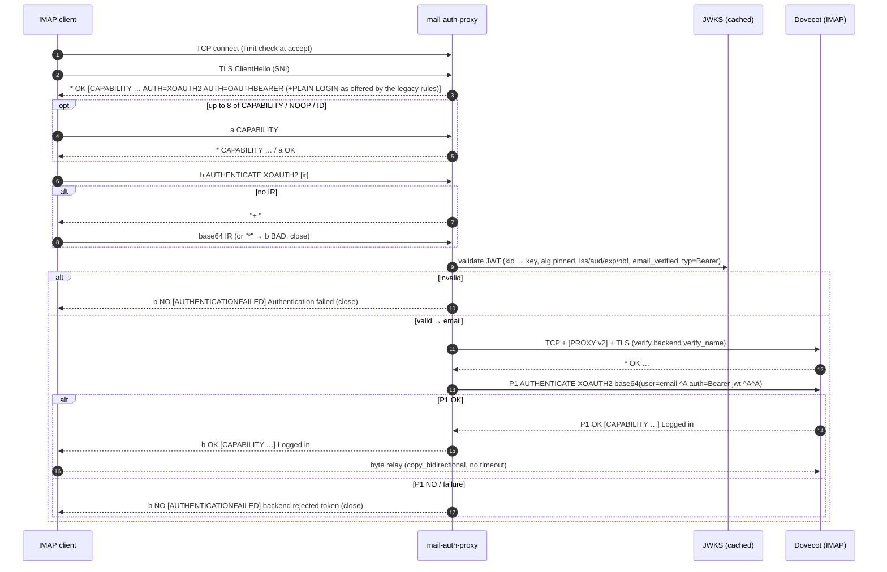
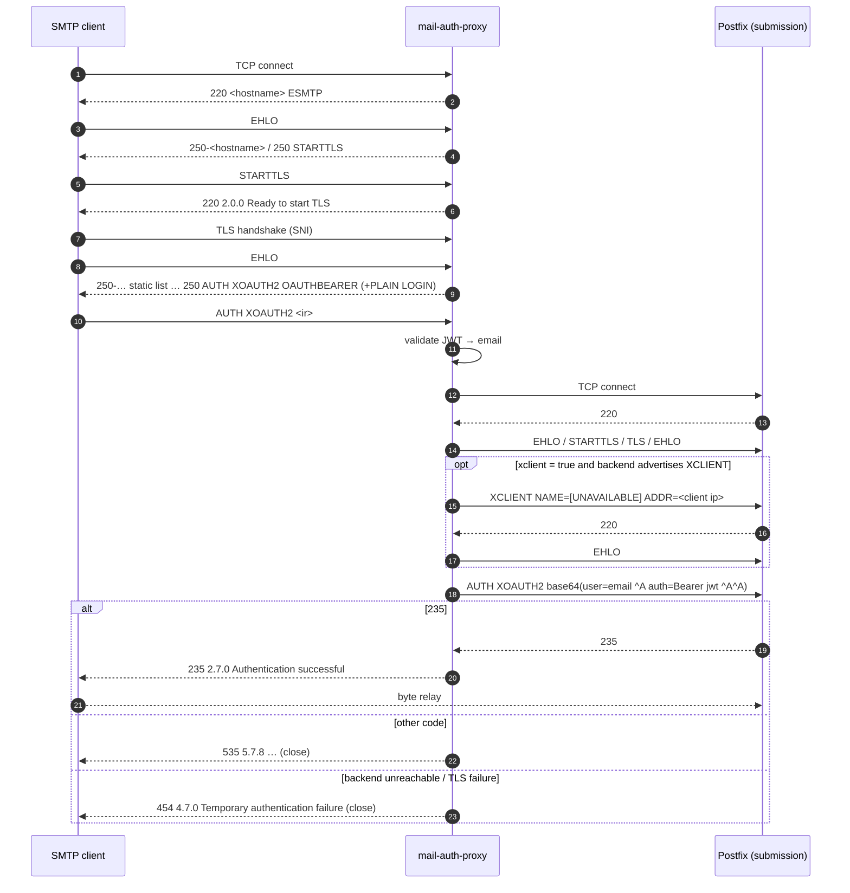
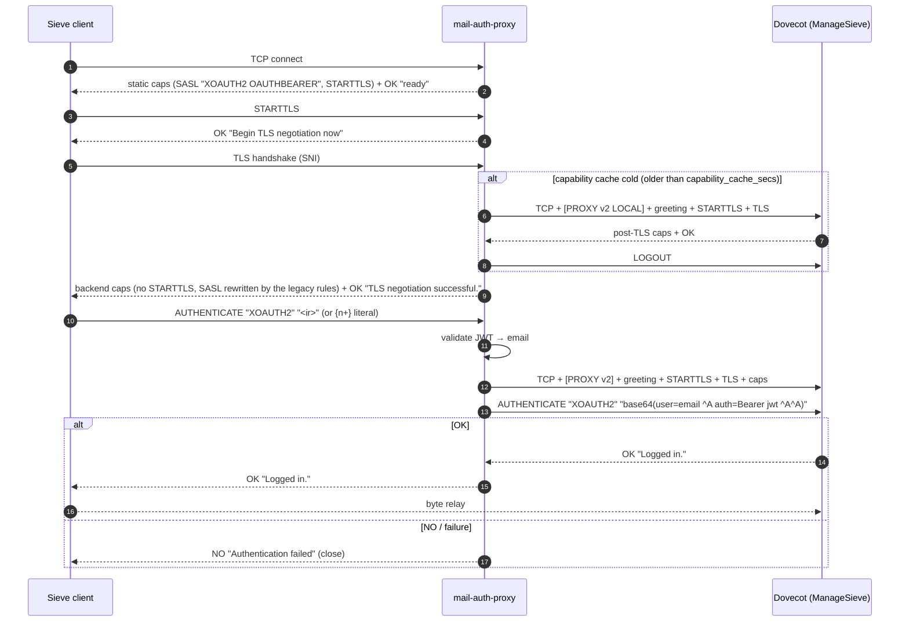

# Protocol dialogs

What the proxy sends and accepts on each protocol before authentication, how it logs in to the backend, and which reply the client gets for each outcome. `<hostname>` stands for `server.hostname`, and the `authlog reason` column refers to the [`authresult` line](operations.md#the-authresult-line). This document is written from the source in `src/proto/` and checked with the black-box tests in `tests/`; where it and the code disagree, the code wins. Deviations from the standards are listed one by one in [standards.md](standards.md).

## IMAP (implicit TLS)

### IMAP: pre-auth dialog

On connect, the proxy completes the TLS handshake (inside the pre-auth budget) and then sends a greeting:

```
* OK [CAPABILITY IMAP4rev1 IMAP4rev2 SASL-IR LOGINDISABLED AUTH=XOAUTH2 AUTH=OAUTHBEARER] <hostname> ready
* OK [CAPABILITY IMAP4rev1 IMAP4rev2 SASL-IR AUTH=XOAUTH2 AUTH=OAUTHBEARER AUTH=PLAIN AUTH=LOGIN] <hostname> ready   (PLAIN and LOGIN offered by a legacy rule)
```

A line is split as `<tag> SP <command> [SP <rest>]`. Commands are case-insensitive, and the tag is any non-empty token.

| Client sends | Proxy replies | Connection |
|---|---|---|
| `t CAPABILITY` | `* CAPABILITY <same list>` + `t OK CAPABILITY completed` | stays open |
| `t NOOP` | `t OK NOOP completed` | stays open |
| `t ID …` | `* ID NIL` + `t OK ID completed` | stays open |
| `t LOGOUT` | `* BYE <hostname> signing off` + `t OK LOGOUT completed` | closed; no authlog line |
| `t LOGIN <user> <pass>` (atom or quoted string with `\"` `\\` escapes) | goes to the credential phase | |
| `t LOGIN` with a literal `{n}` or bad quoting | `t BAD LOGIN arguments` | closed |
| `t LOGIN "" x` | `t NO LOGIN empty field` | closed |
| `t AUTHENTICATE <mech> [<ir>]` with a supported mech | SASL exchange, [below](#imap-sasl-exchange) | |
| `t AUTHENTICATE` (no mech) | `t BAD AUTHENTICATE needs a mechanism` | closed |
| `t AUTHENTICATE CRAM-MD5` (any other mech) | `t NO unsupported SASL mechanism` | closed |
| any other command, including `STARTTLS`, `ENABLE`, `SELECT` | `t NO command not supported before authentication` | closed |
| a line without tag or command, or an empty line | `* BAD expected: tag command` | closed |
| an 8th non-final command | its reply, then `* BYE too many commands before authentication` | closed |

On an OAuth-only endpoint the capabilities include `LOGINDISABLED`. A `LOGIN` command sent anyway is parsed so the attempt can be logged, then rejected ([decision](#imap-decision-and-backend-login)).

A client that reads the greeting and disconnects before its first command (a health check) ends the session cleanly, with no authlog record and no pre-auth abort.

### IMAP: SASL exchange

- Initial response: the SASL-IR on the command line is used if it is non-empty. Otherwise the proxy sends `+ ` (plus and a space) and reads one line. An IR of `=` is not read as "empty initial response" (RFC 4959); it is base64-decoded, which fails.
- LOGIN: `+ VXNlcm5hbWU6`, then `+ UGFzc3dvcmQ6`. Each answer is base64. An IR on the command line is the username, and only the password prompt follows.
- Cancel: a line that is only `*` cancels. Any decoding or parse error also ends the exchange. Both are answered with `t BAD AUTHENTICATE failed: invalid or cancelled response`, and the connection closes.

### IMAP: decision and backend login

| Situation | Client sees | authlog `reason` |
|---|---|---|
| password with a mechanism the connection does not offer | `t NO password authentication not available on this endpoint` | `blocked_endpoint` (with `pwfp`) |
| password refused by the legacy gate (user not allowed, unknown domain or account, throttled, password over 1024 bytes) | `t NO [AUTHENTICATIONFAILED] backend rejected credentials`, after `failure_delay_ms` (see below) | `blocked_endpoint`, `unknown_domain`, `unknown_account`, `throttled`, `oversize` (with `pwfp`) |
| account check unavailable | `t NO [UNAVAILABLE] Backend temporarily unavailable` | none (counted in `mail_auth_proxy_backend_errors_total`) |
| OAuth token fails validation | `t NO [AUTHENTICATIONFAILED] Authentication failed` | `bad_token` |
| OAuth token valid, but `user=` / `a=` names another identity | `t NO [AUTHORIZATIONFAILED] Authorization failed` | `authzid_mismatch` |
| OAuth valid, backend answers `NO` (after its XOAUTH2 error challenge) | `t NO [AUTHENTICATIONFAILED] backend rejected token` | `backend_reject` |
| password, backend answers `NO` | `t NO [AUTHENTICATIONFAILED] backend rejected credentials`, after `failure_delay_ms` | `backend_reject` (with `pwfp`) |
| backend unreachable, TLS or greeting failure, or the backend answers `NO` with a temporary RFC 5530 code (`[UNAVAILABLE]`, e.g. its passdb is down; `[INUSE]`, `[SERVERBUG]`, `[LIMIT]`) or `BAD` | `t NO [UNAVAILABLE] Backend temporarily unavailable` | none (counted in `mail_auth_proxy_backend_errors_total`) |
| success | `t ` + the backend's own tagged reply text, e.g. `t OK [CAPABILITY IMAP4rev1 IDLE MOVE] Logged in` | `ok` |

Every failure closes the connection; there is one authentication attempt per connection.

Backend login steps:

1. TCP connect.
2. PROXY v2 header (optional).
3. TLS handshake, verified.
4. Read the greeting; it must start with `* OK`.
5. Send `P1 AUTHENTICATE XOAUTH2 <ir>` or `P1 AUTHENTICATE PLAIN <ir>`.
6. Read up to 32 lines:
   - `P1 OK…` means success; its text is relayed.
   - `P1 NO` means rejection, except with `[UNAVAILABLE]`, `[INUSE]`, `[SERVERBUG]` or `[LIMIT]`, which mean an outage.
   - `P1 BAD` means an outage for a token. For a password it means a rejection, unless it answers the proxy's own `*` cancel.
   - An untagged `* BYE` (e.g. Dovecot's connection limit, shutdown) is an outage.
   - For XOAUTH2, the first `+` continuation is the error challenge (`+ <base64 JSON>`) and is answered with an empty line, after which the backend sends its tagged `NO`. Any other continuation is answered with `*` (cancel).
   - Untagged backend lines before the tagged reply are discarded.

### IMAP: sequence



## SMTP submission (STARTTLS)

### SMTP: before TLS

The banner is `220 <hostname> ESMTP`.

| Client sends | Proxy replies |
|---|---|
| `EHLO x` | `250-<hostname>` / `250 STARTTLS` |
| `HELO x` | `250 <hostname>` |
| `MAIL`, `RCPT`, `DATA`, `BDAT` | `530 5.7.0 Must issue STARTTLS first` |
| `NOOP`, `RSET` | `250 OK` |
| `AUTH …` | `530 5.7.0 Must issue STARTTLS first` |
| `STARTTLS` | `220 2.0.0 Ready to start TLS`, then TLS handshake |
| `QUIT` | `221 2.0.0 Bye` (closed) |
| anything else | `502 5.5.1 Command not recognized` |
| after the 8th command (sent unprompted) | `421 4.7.0 Too many commands before STARTTLS` (closed) |

### SMTP: after TLS

| Client sends | Proxy replies |
|---|---|
| `HELO` | `250 <hostname>` |
| `MAIL`, `RCPT`, `DATA`, `BDAT` | `530 5.7.0 Authentication required` |
| `EHLO` | `250-<hostname>`, one `250-` line per `submission.ehlo_extensions` entry (default PIPELINING, ENHANCEDSTATUSCODES, 8BITMIME, DSN, SMTPUTF8, CHUNKING), `250 AUTH XOAUTH2 OAUTHBEARER[ PLAIN LOGIN]` |
| `NOOP`, `RSET`, `QUIT`, other | as before TLS (`STARTTLS` now gets `502`) |
| after the 8th command (sent unprompted) | `421 4.7.0 Too many commands before AUTH` (closed) |
| `AUTH` without mech | `501 5.5.4 Syntax: AUTH mechanism [initial-response]` (closed) |
| `AUTH <other mech>` | `504 5.5.4 Unrecognized authentication type` (closed) |
| `AUTH <mech>` without IR | `334 ` (with a trailing space), then one response line |
| `AUTH LOGIN` | `334 VXNlcm5hbWU6`, `334 UGFzc3dvcmQ6`. With an IR (`AUTH LOGIN <b64user>`) only `334 UGFzc3dvcmQ6` follows. |
| `*` cancel, bad base64, bad SASL, `AUTH PLAIN =` | `501 5.5.2 Invalid or cancelled authentication response` (closed) |

The EHLO extension list is static: it does not come from the backend, and `SIZE` is left out. The client keeps this view for the whole session, because it does not send EHLO again after AUTH.

### SMTP: decision and backend login

| Situation | Client sees | authlog `reason` |
|---|---|---|
| password with a mechanism the connection does not offer | `504 5.5.4 password authentication not available on this endpoint` | `blocked_endpoint` |
| password refused by the legacy gate (including a password over 1024 bytes) | `535 5.7.8 Authentication credentials invalid`, after `failure_delay_ms` (see below) | `blocked_endpoint`, `unknown_domain`, `unknown_account`, `throttled`, `oversize` |
| account check unavailable | `454 4.7.0 Temporary authentication failure` | none (counted in `mail_auth_proxy_backend_errors_total`) |
| token invalid | `535 5.7.8 Authentication credentials invalid` | `bad_token` |
| token valid, but `user=` / `a=` names another identity | `535 5.7.8 Authentication credentials invalid` | `authzid_mismatch` |
| backend connect, greeting, EHLO, STARTTLS, TLS or XCLIENT fails | `454 4.7.0 Temporary authentication failure` | none (counted in `mail_auth_proxy_backend_errors_total`) |
| backend advertises `XCLIENT` but `submission.xclient = false`, or still advertises it after the proxy's `XCLIENT` (misconfiguration, no credential is sent) | `454 4.7.0 Temporary authentication failure` | none (counted in `mail_auth_proxy_backend_errors_total`) |
| backend AUTH reply 4xx (temporary, e.g. SASL backend down) | `454 4.7.0 Temporary authentication failure` | none (counted in `mail_auth_proxy_backend_errors_total`) |
| backend reply other than `334` to the bare `AUTH` line (e.g. 503, 504); reply 500 to 509 (syntax class) to a token response; any other reply without a verdict | `454 4.7.0 Temporary authentication failure` | none (counted in `mail_auth_proxy_backend_errors_total`) |
| backend reply 500 to 509 to a password response (after `334`) | `535 5.7.8 Authentication credentials invalid`, after `failure_delay_ms` | `backend_reject` |
| backend AUTH reply 510 to 599 (e.g. `535`) | `535 5.7.8 Authentication credentials invalid` (password: after `failure_delay_ms`) | `backend_reject` |
| backend `235` | `235 2.7.0 Authentication successful`, then relay | `ok` |

Every failure closes the connection. Backend login steps:

1. Connect; expect `220`.
2. `EHLO <hostname>`; expect `250` and `STARTTLS` among the extensions.
3. `STARTTLS`; expect `220`.
4. TLS handshake, verified.
5. `EHLO <hostname>`; expect `250`.
6. (optional) `XCLIENT …`; expect `220`, then `EHLO` again and expect `250`. If the backend advertises `XCLIENT` but `submission.xclient = false`, or the `EHLO` after the proxy's `XCLIENT` still lists `XCLIENT`, the login stops here as an outage. Otherwise, once the relay starts, the authenticated client could send its own `XCLIENT LOGIN=… ADDR=…` on the proxy's authorization.
7. `AUTH XOAUTH2` or `AUTH PLAIN` without an initial response; expect `334`, then send the response on its own line. This keeps the AUTH command line short whatever the token size: Postfix limits command lines to `line_length_limit` (default 2048 octets) but SASL responses to 12288. An XOAUTH2 error challenge (`334 <base64 JSON>`) is answered with an empty line, after which the backend sends its final reply.

Commands the client pipelines after `AUTH` in the same TLS record are kept in the buffer and reach the backend after `235`. A black-box test covers this.

### SMTP: sequence



## ManageSieve (STARTTLS)

### ManageSieve: before TLS

The greeting is the same for every endpoint, including the internal one. It lists no SASL mechanism, so a client is never invited to send a token or password in the clear (RFC 5804 §1.7 allows an empty list when STARTTLS is offered):

```
"IMPLEMENTATION" "<hostname>"
"SASL" ""
"SIEVE" "<backend's extensions>"
"STARTTLS"
"VERSION" "1.0"
OK "ready"
```

The `"SIEVE"` line is the backend's, from the last successful capability probe ([after TLS](#managesieve-after-tls)) whatever its age; the greeting never opens a backend connection itself. Until the first probe after startup it is missing.

| Client sends | Proxy replies |
|---|---|
| `STARTTLS` | `OK "Begin TLS negotiation now"`, then TLS handshake |
| `LOGOUT` | `OK "Bye"` (closed) |
| `AUTHENTICATE …` | `NO (ENCRYPT-NEEDED) "STARTTLS required"` (the connection stays open) |
| anything else, including `CAPABILITY` | `NO "Command not permitted before STARTTLS"` |
| after the 8th command (sent unprompted) | `NO "Too many commands before STARTTLS"` (closed) |

### ManageSieve: after TLS

1. The proxy fetches the backend's post-TLS capabilities from a cache (`sieve.capability_cache_secs`, default 600 s). On a cache miss it opens a probe session: connect, PROXY v2 `LOCAL` header, greeting, `STARTTLS`, TLS, capabilities, `LOGOUT`.
2. It relays those lines with two changes:
   - `"STARTTLS"` is dropped.
   - The `"SASL"` line is replaced by `"SASL" "XOAUTH2 OAUTHBEARER"` or, when a legacy rule offers PLAIN, `"SASL" "XOAUTH2 OAUTHBEARER PLAIN"`. If the backend sends no SASL line, the client gets none.
   - Everything else (`IMPLEMENTATION`, `SIEVE`, `NOTIFY`, `VERSION`, …) is relayed unchanged, including the backend's implementation string, which unauthenticated clients can see.
3. It sends `OK "TLS negotiation successful."`.
4. If the probe fails, the client gets `BYE "Service temporarily unavailable"` and the connection closes.

Before `AUTHENTICATE`, `CAPABILITY` (the capability list again, then `OK "Capability completed."`), `NOOP` (`OK "NOOP completed."`) and `LOGOUT` (`OK "Logout completed."`, clean end, no authlog line) are answered; after `limits.max_preauth_commands` commands the client gets `BYE "Too many commands before AUTHENTICATE"`. Any other command is taken as the authentication attempt:

| Form | Handling |
|---|---|
| `AUTHENTICATE "MECH" "base64"` | quoted IR (`\"` escapes handled) |
| `AUTHENTICATE "MECH" {n+}` CRLF `<n bytes>` CRLF (also `{n}`) | literal IR, n ≤ 65536, trailing CRLF consumed |
| `AUTHENTICATE "MECH"` | proxy sends the empty challenge `""` and reads one raw line as bare base64. A quoted string or a literal response (the RFC 5804 forms) is not unquoted and fails. |
| mech not in `XOAUTH2`, `OAUTHBEARER`, `PLAIN` (e.g. `LOGIN`) | `NO "Authentication mechanism not supported"`. With no IR, this comes *after* the `""` challenge has been sent and answered. |
| anything else (another command, unquoted mech, bad literal, literal > 64 KiB) | `NO "Invalid AUTHENTICATE"` (closed) |
| undecodable SASL, or `"*"` / `*` as the response | `NO "Invalid authentication response"` (closed) |

### ManageSieve: decision and backend login

| Situation | Client sees | authlog `reason` |
|---|---|---|
| token invalid | `NO "Authentication failed"` | `bad_token` |
| token valid, but `user=` / `a=` names another identity | `NO "Authorization failed"` | `authzid_mismatch` |
| PLAIN and the connection does not offer it | `NO "password authentication not available on this endpoint"` | `blocked_endpoint` |
| PLAIN refused by the legacy gate (including a password over 1024 bytes) | `NO "Authentication failed"`, after `failure_delay_ms` (see below) | `blocked_endpoint`, `unknown_domain`, `unknown_account`, `throttled`, `oversize` |
| account check unavailable | `NO (TRYLATER) "Service temporarily unavailable"` | none (counted in `mail_auth_proxy_backend_errors_total`) |
| backend reply does not start with `OK` | `NO "Authentication failed"` | `backend_reject` |
| backend session fails (connect, TLS, capabilities) or answers `NO (TRYLATER)` | `NO (TRYLATER) "Service temporarily unavailable"` | none (counted in `mail_auth_proxy_backend_errors_total`) |
| backend `OK …` | the backend's reply line verbatim (e.g. `OK "Logged in."`), then relay | `ok` |

The backend session is opened only after the credential has passed the local checks. It sends `AUTHENTICATE "XOAUTH2" "<ir>"` or `AUTHENTICATE "PLAIN" "<ir>"` and reads one reply line. An authenticated session therefore uses one backend connection, plus one probe connection when the capability cache is cold.

### ManageSieve: sequence



## Surprising and client-incompatible behaviour

1. **One authentication attempt per connection.** Any failed or unsupported AUTH/AUTHENTICATE, and any unknown pre-auth command, closes the connection. Python `smtplib.login()` falls back from PLAIN to LOGIN on the same connection after a 535, so it raises `SMTPServerDisconnected` instead of `SMTPAuthenticationError`.
2. **The client's SASL username must match the token for OAuth.** The backend login is always the token's `identity_claim` (default `email`). An XOAUTH2 `user=` (required by the mechanism) or OAUTHBEARER `a=` must be empty, the identity itself, or its local part without a domain (`alice` for `alice@example.org`), all ASCII case-insensitive; anything else, in particular another full address, fails the exchange. OAUTHBEARER is converted to XOAUTH2 for the backend.
3. **A legacy rule with `sni` needs SNI.** Clients connecting by IP (no SNI) or with a different hostname or alias only get OAuth from such a rule, even from its networks.
4. **IMAP:** `IMAP4rev2` is always advertised before authentication whatever the backend supports (after login the backend's real list is relayed). `STARTTLS` on the implicit-TLS port closes the connection. IMAP literals in `LOGIN` are not supported. `AUTHENTICATE PLAIN =` (RFC 4959 empty response) is rejected.
5. **SMTP:** the EHLO list is static (no `SIZE`; `CHUNKING`, `DSN` and `SMTPUTF8` are claimed whatever the backend supports). `AUTH PLAIN =` gets `501`.
6. **ManageSieve:** after STARTTLS only `CAPABILITY`, `NOOP`, `LOGOUT` and `AUTHENTICATE` are accepted, and `CAPABILITY` is refused before TLS. A continuation response must be bare base64 (RFC-conformant quoted or literal strings fail). There is no `LOGIN`. The plaintext greeting lists no mechanism (`"SASL" ""`); the mechanisms appear only after TLS.
7. **Token rules are per issuer.** A wrong `token_type` either rejects every token (`keycloak` for an IdP without the `typ` claim) or lets ID tokens with an accepted audience in (`any`); `email_verified` must be a real boolean when required.
8. **Connection-limit and timeout closes are silent:** no `421`/`BYE`.
9. **No keepalive and no idle limit after authentication.**
10. **Refused passwords are answered slowly.** Every failed legacy login is answered at least `legacy.failure_delay_ms` (default 2 s) after the credential, except a password sent with a mechanism the connection does not offer (`blocked_endpoint` at step 0), which is refused at once. Refusals by the gate wait for the larger of `failure_delay_ms` and the median time of recent backend rejections, plus random jitter; backend rejections get the same jitter. A retry-later on the password path (account check or backend unavailable) is answered no earlier than a refusal. OAuth failures are not delayed. Details in [architecture.md](architecture.md#legacy-gate).
11. **A token with an unknown `kid` can get retry-later.** It is a `bad_token` when the last on-demand JWKS refresh succeeded for the issuer the token claims (also while further refreshes are held back for 30 s). If that refresh failed for the issuer, the client gets retry-later ([architecture.md](architecture.md#oauth-token-validation)).
